Exploratoy Data Analysis on Rossman Store Sales
================
Göksu Yıldırım

Importing used libraries & fonts

``` r
library("dplyr")
library("ggplot2")
library("scales")
library("gridExtra")
library("lubridate")
library("extrafont")
library("RColorBrewer")
font_import()
```

    ## Importing fonts may take a few minutes, depending on the number of fonts and the speed of the system.
    ## Continue? [y/n]

``` r
loadfonts(device="win")
```

Importing data sets

``` r
test <- read.csv("test.csv", stringsAsFactors = FALSE, header = TRUE)
train <- read.csv("train.csv", stringsAsFactors = FALSE, header = TRUE)
store <- read.csv("store.csv", stringsAsFactors = FALSE, header = TRUE)
```

Fixing variable types

``` r
train$DayOfWeek <- as.factor(train$DayOfWeek)
train$Date <- as.Date(train$Date)
train$Open <- as.factor(train$Open)
train$Promo <- as.factor(train$Promo)
train$StateHoliday <- as.factor(train$StateHoliday)
train$SchoolHoliday <- as.factor(train$SchoolHoliday)

test$Date <- as.Date(test$Date)
test$Open <- as.factor(test$Open)
test$StateHoliday <- as.factor(test$StateHoliday)
test$SchoolHoliday <- as.factor(test$SchoolHoliday)
test$Promo <- as.factor(test$Promo)
```

### Exploratory Data Analysis

Let's take a look at the training data

``` r
summary(train)
```

    ##      Store        DayOfWeek       Date                Sales      
    ##  Min.   :   1.0   1:144730   Min.   :2013-01-01   Min.   :    0  
    ##  1st Qu.: 280.0   2:145664   1st Qu.:2013-08-17   1st Qu.: 3727  
    ##  Median : 558.0   3:145665   Median :2014-04-02   Median : 5744  
    ##  Mean   : 558.4   4:145845   Mean   :2014-04-11   Mean   : 5774  
    ##  3rd Qu.: 838.0   5:145845   3rd Qu.:2014-12-12   3rd Qu.: 7856  
    ##  Max.   :1115.0   6:144730   Max.   :2015-07-31   Max.   :41551  
    ##                   7:144730                                       
    ##    Customers      Open       Promo      StateHoliday SchoolHoliday
    ##  Min.   :   0.0   0:172817   0:629129   0:986159     0:835488     
    ##  1st Qu.: 405.0   1:844392   1:388080   a: 20260     1:181721     
    ##  Median : 609.0                         b:  6690                  
    ##  Mean   : 633.1                         c:  4100                  
    ##  3rd Qu.: 837.0                                                   
    ##  Max.   :7388.0                                                   
    ## 

``` r
max(train$Date) - min(train$Date) + 1
```

    ## Time difference of 942 days

``` r
145845*7/(1115)
```

    ## [1] 915.6188

We have data regarding 1115 stores spanning a period of 942 days. An interesting point is that we have differing number of recordings for days of the week. We have more Mondays than Wednesdays and more cases with Thursdays and Fridays and so on.

Even if the occurences for days of week were the same and equal to most frequent one i.e. Thursday/Friday, we would still have days corresponding to approximately 915 days. Currently we have days of the week corresponding to about 912 days. This means we have gap(s) in our data totalling to 30 days.

``` r
ggplot(data=train, aes(x=Date)) +
  geom_freqpoly()  + theme_minimal(base_family="Roboto") 
```

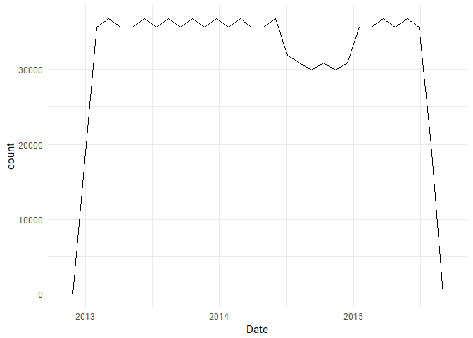

We see a sharp fall within the second half of 2014 for data availability. A quick check on the competition site shows that the missing portion is due to a mistake on Rossmans side during data upload. Since I will not be using a time series approach, I am not awfully bothered by this missing time period.

``` r
ggplot(data=train, aes( x=DayOfWeek, y=Sales, fill=DayOfWeek)) +
  geom_boxplot() + theme_minimal(base_family="Roboto") + 
  labs(x="Day of the Week", title="Sales in Each Day of the Week") +
  scale_fill_brewer(palette="Blues") +
  scale_x_discrete(labels=c("1"="Monday", "2"="Tuesday", "3"="Wednesday", "4"="Thursday", "5"="Friday", "6"="Saturday", "7"="Sunday")) +
  scale_y_continuous(labels = comma) +
  guides(fill=FALSE)
```

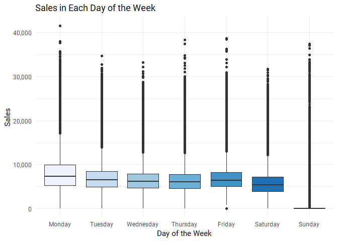

Mondays seem to enjoy slightly higher sales. The median is a bit higher, with a noticably higher 3rd quartile and maximum. Sundays, sales plummet. This is not surprising since the data belongs to stores in Germany, where it's common to have them closed on Sundays.

``` r
ggplot(data=train, aes( x=SchoolHoliday, y=Sales)) +
  geom_boxplot() + ggtitle("Effect of School Holidays to Sales") + theme_minimal(base_family="Roboto") +
scale_y_continuous(labels = comma)
```

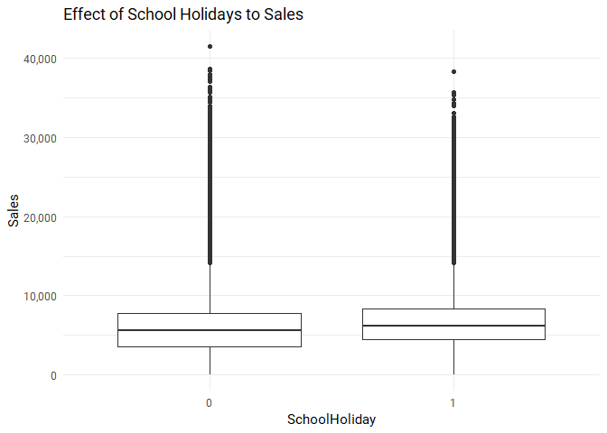

``` r
ggplot(data=train, aes( x=StateHoliday, y=Sales)) +
  geom_boxplot() + ggtitle("Effect of State Holidays to Sales") + theme_minimal(base_family="Roboto") +
scale_y_continuous(labels = comma)
```

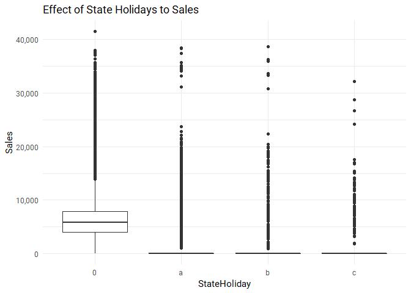

School holidays does not seem to impact sales that much. State holidays however, see plummeting sales since most stores are, again, closed on these days in Germany.

``` r
p2s <- ggplot(data=train, aes( x=Promo, y=Sales)) +
  geom_boxplot() + ggtitle("Effect of Promo to Sales") + theme_minimal(base_family="Roboto")

p2c <- ggplot(data=train, aes( x=Promo, y=Customers)) +
  geom_boxplot() + ggtitle("Effect of Promo to Visiting Customers") + theme_minimal(base_family="Roboto")

grid.arrange(p2s, p2c, nrow=1)
```

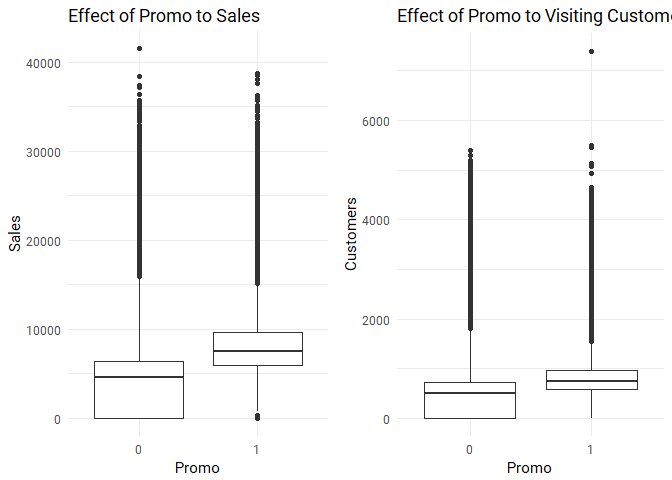

As expected, promo increases sales. However the number of customers is not impacted as much. We can say that main effect of promo is making existing customers spend more, rather than attracting new customers.

We have seen that most stores are closed on Sundays. Let's see if being open on a Sunday means high sales due to decreased competition. I will be removing zero-sale days to see how Sunday performs against weekdays.

``` r
ggplot(data=train[train$Sales > 0,], aes( x=DayOfWeek, y=Customers, fill=DayOfWeek)) +
  geom_boxplot() + theme_minimal(base_family="Roboto") + 
  labs(x="Day of the Week", title="Daily Sales", subtitle="excluding 0-sale entries") +
  scale_fill_brewer(palette="Blues") +
  scale_x_discrete(labels=c("1"="Monday", "2"="Tuesday", "3"="Wednesday", "4"="Thursday", "5"="Friday", "6"="Saturday", "7"="Sunday")) +
  scale_y_continuous(labels = comma) +
  guides(fill=FALSE)
```

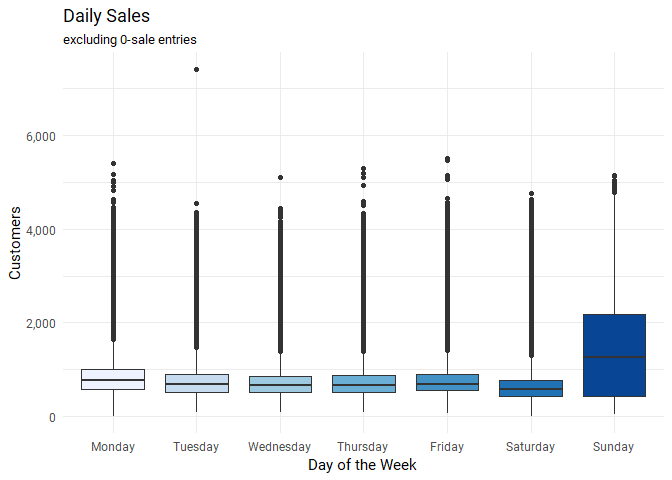

Sundays have a high variance and a significantly higher median sales. Either being open on Sunday increases sales or stores with high sales are chosen to be open on Sundays. Let's look at several stores which are open on Sundays to see which case is true.

``` r
p85 <- ggplot(train[train$Store == 85,], aes(x = Date, y = Sales, color = factor(DayOfWeek == 7))) + 
  geom_point(size = 2) + 
  ggtitle("Sales of Store #85") +
  scale_color_discrete(name="Days",labels=c("Other", "Sunday"))

p259 <- ggplot(train[train$Store == 259,], aes(x = Date, y = Sales, color = factor(DayOfWeek == 7))) + 
  geom_point(size = 2) + 
  ggtitle("Sales of Store #259") +
  scale_color_discrete(name="Days",labels=c("Other", "Sunday"))

p262 <- ggplot(train[train$Store == 262,], aes(x = Date, y = Sales, color = factor(DayOfWeek == 7))) + 
  geom_point(size = 2) + 
  ggtitle("Sales of Store #262") +
  scale_color_discrete(name="Days",labels=c("Other", "Sunday"))

p274 <- ggplot(train[train$Store == 274,], aes(x = Date, y = Sales, color = factor(DayOfWeek == 7))) + 
  geom_point(size = 2) + 
  ggtitle("Sales of Store #274") +
  scale_color_discrete(name="Days",labels=c("Other", "Sunday"))

grid.arrange(p85,p259,p262,p274, nrow=2)
```

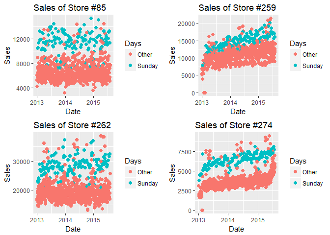

It's pretty clear that stores that are open on Sundays enjoy higher than average sales on these days.

Now let's take a look at the **store** dataset that includes further information about the stores.

``` r
str(store)
```

    ## 'data.frame':    1115 obs. of  10 variables:
    ##  $ Store                    : int  1 2 3 4 5 6 7 8 9 10 ...
    ##  $ StoreType                : chr  "c" "a" "a" "c" ...
    ##  $ Assortment               : chr  "a" "a" "a" "c" ...
    ##  $ CompetitionDistance      : int  1270 570 14130 620 29910 310 24000 7520 2030 3160 ...
    ##  $ CompetitionOpenSinceMonth: int  9 11 12 9 4 12 4 10 8 9 ...
    ##  $ CompetitionOpenSinceYear : int  2008 2007 2006 2009 2015 2013 2013 2014 2000 2009 ...
    ##  $ Promo2                   : int  0 1 1 0 0 0 0 0 0 0 ...
    ##  $ Promo2SinceWeek          : int  NA 13 14 NA NA NA NA NA NA NA ...
    ##  $ Promo2SinceYear          : int  NA 2010 2011 NA NA NA NA NA NA NA ...
    ##  $ PromoInterval            : chr  "" "Jan,Apr,Jul,Oct" "Jan,Apr,Jul,Oct" "" ...

``` r
store$StoreType <- as.factor(store$StoreType)
store$Assortment <- as.factor(store$Assortment)
store$CompetitionOpenSinceMonth <- as.factor(store$CompetitionOpenSinceMonth)
store$CompetitionOpenSinceYear <- as.factor(store$CompetitionOpenSinceYear)
store$Promo2 <- as.factor(store$Promo2)
store$Promo2SinceYear <- as.factor(store$Promo2SinceYear)

summary(store)
```

    ##      Store        StoreType Assortment CompetitionDistance
    ##  Min.   :   1.0   a:602     a:593      Min.   :   20.0    
    ##  1st Qu.: 279.5   b: 17     b:  9      1st Qu.:  717.5    
    ##  Median : 558.0   c:148     c:513      Median : 2325.0    
    ##  Mean   : 558.0   d:348                Mean   : 5404.9    
    ##  3rd Qu.: 836.5                        3rd Qu.: 6882.5    
    ##  Max.   :1115.0                        Max.   :75860.0    
    ##                                        NA's   :3          
    ##  CompetitionOpenSinceMonth CompetitionOpenSinceYear Promo2 
    ##  9      :125               2013   : 83              0:544  
    ##  4      : 94               2012   : 82              1:571  
    ##  11     : 92               2014   : 70                     
    ##  3      : 70               2005   : 62                     
    ##  7      : 67               2010   : 55                     
    ##  (Other):313               (Other):409                     
    ##  NA's   :354               NA's   :354                     
    ##  Promo2SinceWeek Promo2SinceYear PromoInterval     
    ##  Min.   : 1.0    2011   :128     Length:1115       
    ##  1st Qu.:13.0    2013   :120     Class :character  
    ##  Median :22.0    2014   : 95     Mode  :character  
    ##  Mean   :23.6    2012   : 81                       
    ##  3rd Qu.:37.0    2009   : 73                       
    ##  Max.   :50.0    (Other): 74                       
    ##  NA's   :544     NA's   :544

First, it's not clear what Promo2 is, and store data set has quite a bit of info about. A search on competition forums reveals a clarification from a Rossman represantative: *"Promo2 is a coupon based mailing campaign that is send to customers of participating stores. Each letter contains several coupons, mostly for a general discount on all products which are valid for three months. So after/right before these coupons have expired we send a new round of mail to our customers"*

So Promo2 is a year-long campaign, that gets stimulation every three months. I would expect this to have an overall positive effect on sales throughout the year. Also a more significant bump is to be expected during the month in which new coupons are sent. If they didn't participate in the last promo, they are reminded to do so, and if they did they get another coupon to encourage repeater shopping.

The columns Promo2SinceWeek and Promo2SinceYear label stores that do not participate in Promo2 with with NA, while PromoInterval does this with blank values.

We do not know the opening Month/Year of competition for 354 stores. Only 3 stores have missing CompetitionDistance.

``` r
length(store[store$CompetitionDistance > 1000,"CompetitionDistance"])
```

    ## [1] 785

``` r
length(store[store$CompetitionDistance > 5000,"CompetitionDistance"])
```

    ## [1] 352

``` r
summary(store$CompetitionOpenSinceYear)
```

    ## 1900 1961 1990 1994 1995 1998 1999 2000 2001 2002 2003 2004 2005 2006 2007 
    ##    1    1    5    2    2    1    8   10   16   27   19   22   62   47   48 
    ## 2008 2009 2010 2011 2012 2013 2014 2015 NA's 
    ##   54   54   55   54   82   83   70   38  354

785 stores, about 70% of all stores, have their competition more than 1 km away! The ratio is 31% for &gt;5km. There is even a "competitor" 75 kms away for a store. That is far. Also, 191 stores started facing competition during the period in our dataset.

Let's take a look at some stores that started facing competition only in 2014, with competition in differing distances.

``` r
store[store$CompetitionOpenSinceYear %in% c("2014"), c("Store","CompetitionDistance", "CompetitionOpenSinceMonth")]
```

    ##      Store CompetitionDistance CompetitionOpenSinceMonth
    ## 8        8                7520                        10
    ## 14      14                1300                         3
    ## 28      28                1200                        10
    ## 30      30                  40                         2
    ## 37      37                4230                        12
    ## 45      45                9710                         2
    ## 52      52                 450                         4
    ## 54      54                7170                         8
    ## 57      57                 420                         6
    ## 84      84               11810                         8
    ## 95      95                1890                        10
    ## 120    120                2290                        12
    ## 126    126                3370                        10
    ## 138    138               25360                        10
    ## 166    166                 100                         4
    ## 169    169                 980                         7
    ## 189    189                5760                         7
    ## 213    213                4030                         3
    ## 249    249               18010                         9
    ## 264    264                 180                         3
    ## 266    266                 360                         3
    ## 268    268                4520                         2
    ## 270    270                1450                         7
    ## 275    275                 300                         5
    ## 276    276                2960                        10
    ## 318    318               32330                         3
    ## 336    336                 190                         7
    ## 361    361                4490                         5
    ## 369    369                5870                         4
    ## 386    386                1460                         4
    ## 391    391                 460                        11
    ## 413    413                 760                         9
    ## 416    416                4650                         6
    ## 423    423                1270                         5
    ## 428    428                2960                        12
    ## 449    449                 120                        12
    ## 488    488                2890                         4
    ## 506    506                1850                        12
    ## 555    555                1560                         1
    ## 556    556                1140                        11
    ## 585    585                 440                         4
    ## 599    599                 580                        11
    ## 601    601                8220                         4
    ## 604    604               10950                         3
    ## 629    629                 510                         7
    ## 635    635               27530                         4
    ## 646    646                 620                         9
    ## 653    653                7520                         7
    ## 677    677                1740                         6
    ## 683    683                2850                         7
    ## 706    706                7830                         9
    ## 715    715               14810                         6
    ## 740    740                6400                         3
    ## 784    784                 560                        10
    ## 800    800                2020                         7
    ## 819    819                 720                        10
    ## 828    828                3290                        12
    ## 872    872                3860                         9
    ## 878    878                1100                        12
    ## 901    901                3170                         4
    ## 903    903                7290                         9
    ## 905    905                  90                         6
    ## 947    947                 460                         3
    ## 956    956                2330                        10
    ## 970    970                 910                        12
    ## 983    983                  40                         3
    ## 986    986                 620                        10
    ## 1019  1019                2740                         7
    ## 1050  1050               13170                         8
    ## 1111  1111                1900                         6

``` r
p1 <- ggplot(data=train[train$Store==8,], aes(x=Date, y=Sales)) +
  geom_smooth() + ggtitle("Sales over time for Store #8 (7520 km)") + theme_minimal(base_family="Roboto")

p2 <- ggplot(data=train[train$Store==30,], aes(x=Date, y=Sales)) +
  geom_smooth() + labs(title="Sales over time for Store #30 (40 km)", y="") + theme_minimal(base_family="Roboto")

p3 <- ggplot(data=train[train$Store==28,], aes(x=Date, y=Sales)) +
  geom_smooth() + ggtitle("Sales over time for Store #28 (1200 km)") + theme_minimal(base_family="Roboto")

p4 <- ggplot(data=train[train$Store==138,], aes(x=Date, y=Sales)) +
  geom_smooth() + labs(title="Sales over time for Store #138 (25360 km)", y="") + theme_minimal(base_family="Roboto")

grid.arrange(p1,p2,p3,p4, nrow=2)
```

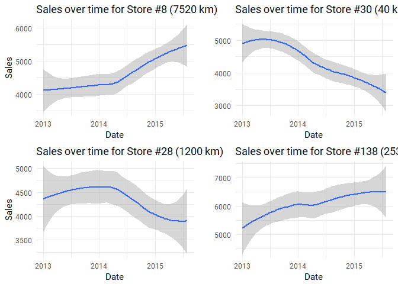

Interestingly, competition does not seem to affect sales much. Maybe it just makes the market bigger.

Now let's see how Promo2 effects sales.

``` r
train$Month <- as.factor(month(train$Date))
train$Day <- as.factor(day(train$Date))
```

``` r
summary(as.factor(store$PromoInterval))
```

    ##                   Feb,May,Aug,Nov  Jan,Apr,Jul,Oct Mar,Jun,Sept,Dec 
    ##              544              130              335              106

Since Promo2 is renewed every four months, as suspected, there are only three possible patterns among the participating stores and no exceptions. For the sake of simplicity I will take only the first month (Jan/Feb/March) where the promo2 starts in my analysis. However before proceeding, we need to create some data points that are currently missing.

**Promo2 First Month**

``` r
store$PromoStart <- NA
store[store$PromoInterval=="Jan,Apr,Jul,Oct", "PromoStart"] <- "Jan"
store[store$PromoInterval=="Feb,May,Aug,Nov", "PromoStart"] <- "Feb"
store[store$PromoInterval=="Mar,Jun,Sept,Dec", "PromoStart"] <- "Mar"
store$PromoStart <- as.factor(store$PromoStart)
```

``` r
janp <- ggplot(data=train[train$Store %in% store[store$PromoStart=="Jan", "Store"],], aes(x=Month, y=Sales, fill=Month)) + 
  geom_boxplot() + ggtitle("Promo2 Jan Start")  + theme_minimal(base_family="Roboto")+ scale_fill_brewer(palette="Spectral") +
   scale_fill_hue(l = 65) +
  scale_x_discrete(labels=c("1"="Jan", "2"="Feb", "3"="Mar", "4"="Apr", "5"="May", "6"="Jun", "7"="Jul", "8"="Aug", "9"="Sep", "10"="Oct", "11"="Nov", "12"="Dec")) +
  scale_y_continuous(labels = comma) +
  theme(axis.text.x = element_text(angle=90)) +
  guides(fill=FALSE)

febp <- ggplot(data=train[train$Store %in% store[store$PromoStart=="Feb", "Store"],], aes(x=Month, y=Sales, fill=Month)) +
  geom_boxplot() + labs(title="Promo2 Feb Start", y="") + theme_minimal(base_family="Roboto") + scale_fill_brewer(palette="Spectral") +
   scale_fill_hue(l = 65) +
  scale_x_discrete(labels=c("1"="Jan", "2"="Feb", "3"="Mar", "4"="Apr", "5"="May", "6"="Jun", "7"="Jul", "8"="Aug", "9"="Sep", "10"="Oct", "11"="Nov", "12"="Dec")) +
  scale_y_continuous(labels = comma) +
  theme(axis.text.x = element_text(angle=90)) +
  guides(fill=FALSE)

marp <- ggplot(data=train[train$Store %in% store[store$PromoStart=="Mar", "Store"],], aes(x=Month, y=Sales, fill=Month)) +
  geom_boxplot() + labs(title="Promo2 Mar Start", y="") + theme_minimal() +       scale_fill_brewer(palette="Spectral") +
   scale_fill_hue(l = 65) +
  scale_x_discrete(labels=c("1"="Jan", "2"="Feb", "3"="Mar", "4"="Apr", "5"="May", "6"="Jun", "7"="Jul", "8"="Aug", "9"="Sep", "10"="Oct", "11"="Nov", "12"="Dec")) +
  scale_y_continuous(labels = comma) +
  theme(axis.text.x = element_text(angle=90)) +
  guides(fill=FALSE)

grid.arrange(janp, febp, marp, nrow=1)
```

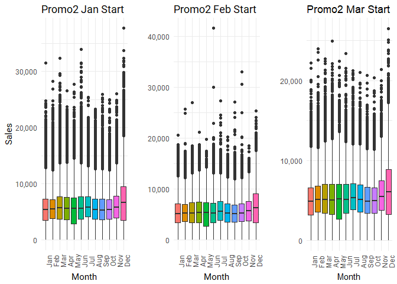

Promo2 does not seem to be affecting sales, which I find very interesting. This is very counterintuitive. I might be making a mistake drawing up or interpreting chart above. Let's calculate total monthly sales for each store and plotting that.

**Calculating Total Monthly Sales for Each Store**

``` r
sum(train[train$Month=="1","Sales"])
```

    ## [1] 566728724

``` r
sum(train[train$Month=="2","Sales"])
```

    ## [1] 528734410

``` r
train$YearMo <- as.factor(paste(year(train$Date), month(train$Date), sep="-"))
train$MonthlySaleOfStore <- NA

train <- train[order(train$Date, train$Store),]

for(i in levels(train$YearMo)){
  for(j in 1:1115) {
    train[train$Store==j & train$YearMo==i, "MonthlySaleOfStore"] <- sum(train[train$Store==j & train$YearMo==i, "Sales"])
  }
}
```

``` r
MonthlySaleCalculator <- function(data, fYearMo) {
sum(unique(data[data[["YearMo"]] == fYearMo,"MonthlySaleOfStore"]))}
```

**Plotting**

``` r
train$YearMo <- factor(train$YearMo, levels(train$YearMo)[c(1,5:12,2,3,4,13,17:24,14:16,25:32)])

plotDataRaw_Jan <- train[train$Store %in% store[store$PromoStart=="Jan", "Store"],]
plotDataAgg_Jan <- aggregate(plotDataRaw_Jan$Sales, by=list(YearMo=plotDataRaw_Jan$YearMo), FUN=sum)

plotDataRaw_Feb <- train[train$Store %in% store[store$PromoStart=="Feb", "Store"],]
plotDataAgg_Feb <- aggregate(plotDataRaw_Feb$Sales, by=list(YearMo=plotDataRaw_Feb$YearMo), FUN=sum)

plotDataRaw_Mar <- train[train$Store %in% store[store$PromoStart=="Mar", "Store"],]
plotDataAgg_Mar <- aggregate(plotDataRaw_Mar$Sales, by=list(YearMo=plotDataRaw_Mar$YearMo), FUN=sum)


ggplot(data=plotDataAgg_Jan, aes(x=YearMo, y=x, fill=x)) + 
  geom_col() +
  theme(axis.text.x = element_text(angle=90), axis.title.x = element_text(face="bold"), axis.title.y = element_text(face="bold")) + 
  scale_y_continuous(labels = comma)  + 
  scale_fill_continuous(name="Total Sales", labels = comma) +
  labs(x="Months", y="Total Sales", title="Total Sales in Each Month", subtitle="for stores starting Promo2 in January")
```

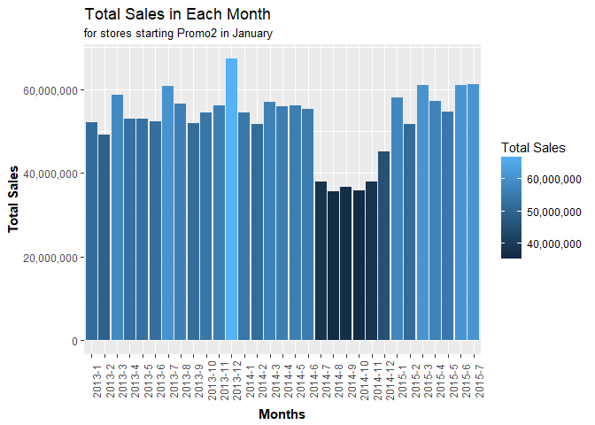

``` r
ggplot(data=plotDataAgg_Feb, aes(x=YearMo, y=x, fill=x)) + 
  geom_col() +
  theme(axis.text.x = element_text(angle=90), axis.title.x = element_text(face="bold"), axis.title.y = element_text(face="bold")) + 
  scale_y_continuous(labels = comma)  + 
  scale_fill_continuous(name="Total Sales", labels = comma) +
  labs(x="Months", y="Total Sales", title="Total Sales in Each Month", subtitle="for stores starting Promo2 in February")
```

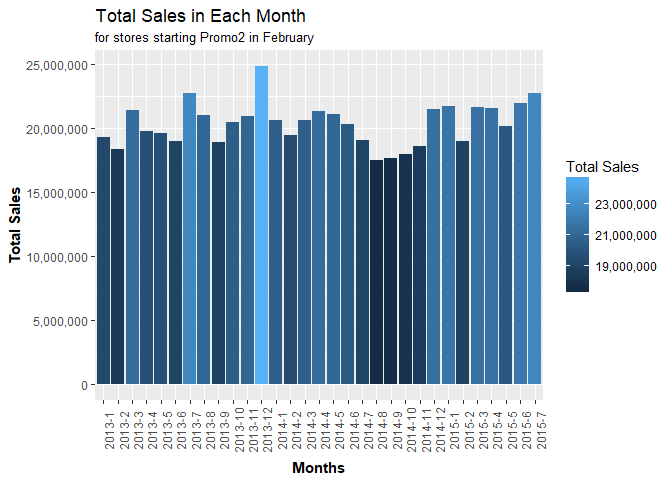

``` r
ggplot(data=plotDataAgg_Mar, aes(x=YearMo, y=x, fill=x)) + 
  geom_col() +
  theme(axis.text.x = element_text(angle=90), axis.title.x = element_text(face="bold"), axis.title.y = element_text(face="bold")) + 
  scale_y_continuous(labels = comma)  + 
  scale_fill_continuous(name="Total Sales", labels = comma) +
  labs(x="Months", y="Total Sales", title="Total Sales in Each Month", subtitle="for stores starting Promo2 in March")
```

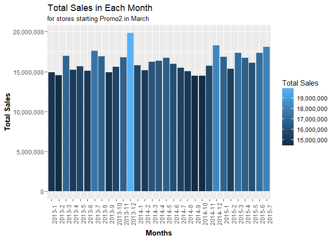

Again, unintuitivtely, Promo2 does not seem to affect sales either.

### Self-review

My purpose with this exercise was to force myself to use more and fancier graphs and get used to working with ggplot2 and I think I've done that. I also thought I should do a better job with exploratory analysis when doing a complete project, so I wanted to practice that as well.

**Planning:** I kind of dove right into this. In hindsight, I should have done some planning first. Things got confusing, inefficient and slow because I did not have, at least a semi-clear, road map to follow. *Planning what and how I was going to explore would be the single best thing to do to improve the quality of my work.* I would have completed the project faster, would have been able to build a narrative instead of abrupt cuts to different relationships and be more comprehensive.

**Long vs Wide:** This is the first time I worked with a dataset in a long format and noticed I am not really comfortable with it. I should practice with further datasets to get used to the long format.

**Time-Series:** At first, I thought a time-series approach would be required to tackle this dataset. I read around in the competition discussion and saw that regression was the overwhelming approach. Why? I don't really know. I should learn the disctinction. Well, actually I should probably learn about time-series first...
