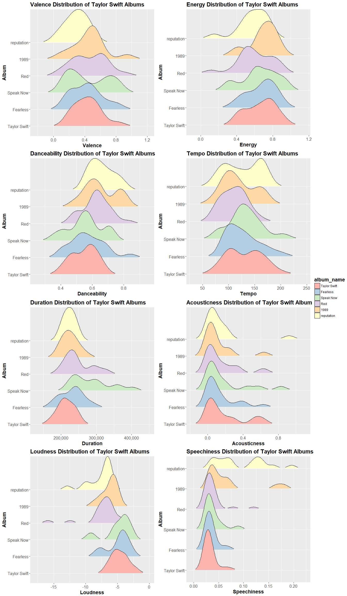
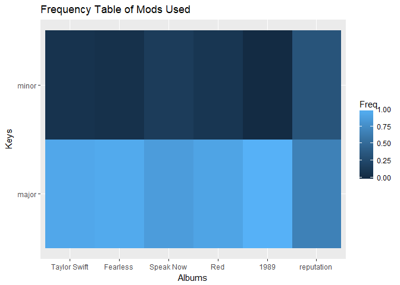
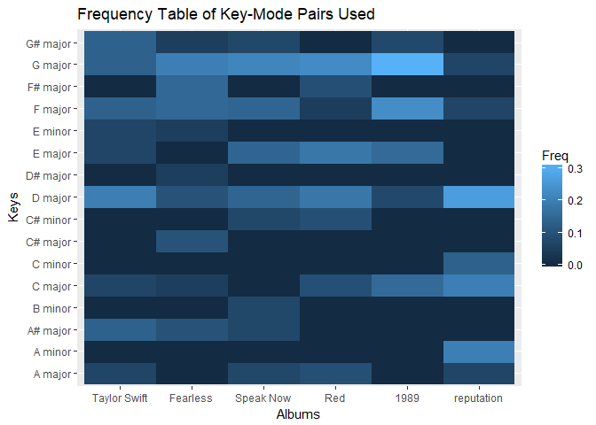
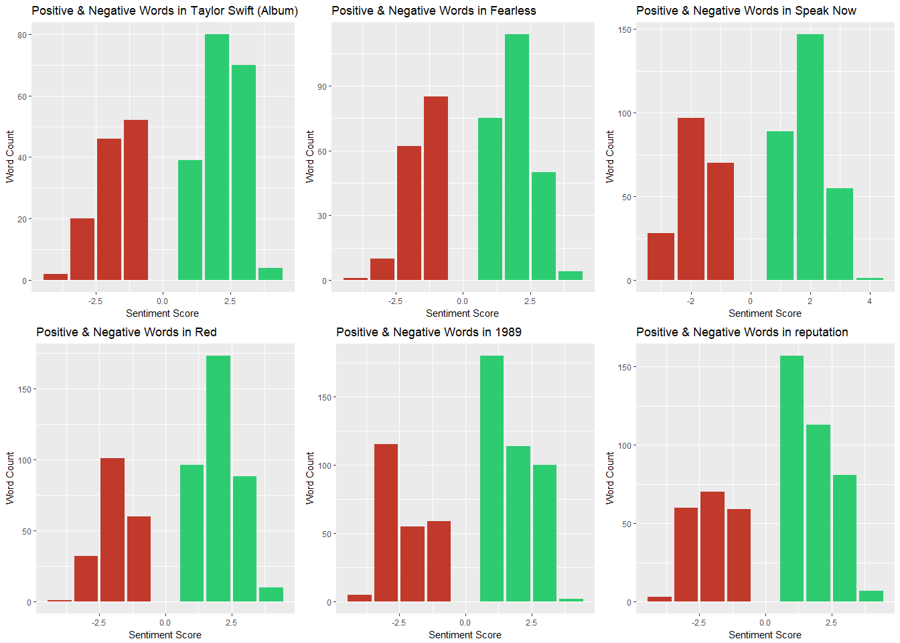

Analysis on Taylor Swift - reputation
================
Göksu Yıldırım

Installing and loading needed packages. There are two non-CRAN packages we will need to download from GitHub.

``` r
devtools::install_github("josiahparry/geniusR")
devtools::install_github("charlie86/spotifyr")

library("geniusR")
library("spotifyr")
library("tidyverse")
library("ggridges")
library("scales")
library("gridExtra")
library("grid")
library("tidytext")
library("lemon")
```

After creating a developer account and saving our Spotify API token we're good to go! Let's pull the data for Taylor Swift with the help of SpotifyR package..

``` r
swift_spotify <- get_artist_audio_features('taylor swift')
```

    ## 
     Progress: ¦¦¦¦¦¦¦¦¦¦¦¦¦¦¦¦¦¦¦¦¦¦¦¦¦¦¦¦¦¦¦¦¦¦¦¦¦¦¦¦¦¦¦¦¦¦¦¦¦¦¦¦¦¦¦¦¦¦    100%
     Progress: ¦¦¦¦¦¦¦¦¦¦¦¦¦¦¦¦¦¦¦¦¦¦¦¦¦¦¦¦¦¦¦¦¦¦¦¦¦¦¦¦¦¦¦¦¦¦¦¦¦¦¦¦¦¦¦¦¦¦¦¦¦ 100%
    ## 
    ## 
     Progress: ¦¦¦¦¦¦¦¦¦¦¦¦¦¦¦¦¦¦¦¦¦¦¦¦¦¦¦¦¦¦¦¦¦¦¦¦¦¦¦¦¦¦¦¦¦¦¦¦¦¦¦¦¦¦¦¦¦¦¦¦¦ 100%

Now, the data has a lot of stuff we are not going to use. So I'm going to remove unnecessary columns and everything but studio albums.

``` r
swift_spotify <- swift_spotify[,!colnames(swift_spotify) %in% c("artist_name","artist_uri", "album_uri","is_collaboration","album_img","track_uri", "track_preview_url","track_open_spotify_url","album_release_year","album_type")]

swift_spotify <- swift_spotify[swift_spotify$album_name %in% c("1989", "Fearless", "Red", "reputation", "Speak Now", "Taylor Swift"),]

swift_spotify <- swift_spotify[order(swift_spotify$album_release_date),]
```

    ## Error in `$<-.data.frame`(`*tmp*`, album_type, value = structure(integer(0), .Label = character(0), class = "factor")): replacement has 0 rows, data has 144

Now that we have audio data, let's get the lyrics using GeniusR package.

``` r
album1989_lyrics <- genius_album(artist="Taylor Swift", album="1989")
fearless_lyrics <- genius_album(artist="Taylor Swift", album="Fearless")
reputation_lyrics <- genius_album(artist="Taylor Swift", album="reputation")
speaknow_lyrics <- genius_album(artist="Taylor Swift", album="Speak Now")
taylorswift_lyrics <- genius_album(artist="Taylor Swift", album="Taylor Swift")
red_lyrics <- genius_album(artist="Taylor Swift", album="Red")
```

We need the lyrics for every song exactly once. So let's remove alternative versions of existing songs.

``` r
red_exclude <- c("Treacherous (Original Demo Recording)", "Red (Original Demo Recording)", "State Of Grace (Acoustic Version)")
album1989_exclude <- c("I Know Places (Voice Memo)", "I Wish You Would (Voice Memo)", "Blank Space (Voice Memo)")
fearless_exclude <- c("Love Story (US Pop Mix)")
speaknow_exclude <- c("Back to December (Acoustic)", "Haunted (Acoustic)", "Mine (US)", "Back To December (US)")
taylorswift_exclude <- c("Teardrops on My Guitar - Pop Version")
  
red_lyrics <- red_lyrics[!red_lyrics$track_title %in% red_exclude,]
album1989_lyrics <- album1989_lyrics[!album1989_lyrics$track_title %in% album1989_exclude,]
fearless_lyrics <- fearless_lyrics[!fearless_lyrics$track_title %in% fearless_exclude,]
speaknow_lyrics <- speaknow_lyrics[!speaknow_lyrics$track_title %in% speaknow_exclude,]
taylorswift_lyrics <- taylorswift_lyrics[!taylorswift_lyrics$track_title %in% taylorswift_exclude,]
```

### Spotify & Audio Features

Spotify has numerous metrics that describe songs. Out of them we are going to look into:

**Danceability:** Describes how suitable a track is for dancing based on a combination of musical elements including tempo, rhythm stability, beat strength, and overall regularity

**Duration:** Duration in milliseconds.

**Energy:** Represents a perceptual measure of intensity and activity. Typically, energetic tracks feel fast, loud, and noisy.

**Loudness:** The overall loudness of a track in decibels (dB).

**Tempo:** The overall estimated tempo of a track in beats per minute (BPM) (=the speed or pace of a given piece.)

**Acousticness:** A confidence measure from 0.0 to 1.0 of whether the track is acoustic.

**Valence:** A measure from 0.0 to 1.0 describing the musical positiveness conveyed by a track. Tracks with high valence sound more positive (e.g. happy, cheerful, euphoric), while tracks with low valence sound more negative (e.g. sad, depressed, angry).

**Speechiness:** Speechiness detects the presence of spoken words in a track.

On top of these eight continous measure we're going to look into the keys and modes the songs are composed in. Let's chart the first seven metrics:

``` r
#Valence
val <- ggplot(data=swift_spotify, aes(x=valence, y=album_name, fill=album_name)) +
  geom_density_ridges(scale=2, rel_min_height = 0.03) + 
  labs(x="Valence", y="Album", title="Valence Distribution of Taylor Swift Albums") +
  scale_fill_brewer(palette="Pastel1") +
  scale_x_continuous(labels = comma) +
  theme(axis.text=element_text(size=12), title = element_text(size=14, face="bold"))
  
#Energy
ene <- ggplot(data=swift_spotify, aes(x=energy, y=album_name, fill=album_name)) +
  geom_density_ridges(scale=2, rel_min_height = 0.03) + 
  labs(x="Energy", y="Album", title="Energy Distribution of Taylor Swift Albums") +
  scale_fill_brewer(palette="Pastel1") +
  scale_x_continuous(labels = comma) +
  theme(axis.text=element_text(size=12), title = element_text(size=14, face="bold"))

#Danceability
dan <- ggplot(data=swift_spotify, aes(x=danceability, y=album_name, fill=album_name)) +
  geom_density_ridges(scale=2, rel_min_height = 0.03) + 
  labs(x="Danceability", y="Album", title="Danceability Distribution of Taylor Swift Albums") +
  scale_fill_brewer(palette="Pastel1") +
  scale_x_continuous(labels = comma) +
  theme(axis.text=element_text(size=12), title = element_text(size=14, face="bold"))

#Tempo
tem <- ggplot(data=swift_spotify, aes(x=tempo, y=album_name, fill=album_name)) +
  geom_density_ridges(scale=2, rel_min_height = 0.03) + 
  labs(x="Tempo", y="Album", title="Tempo Distribution of Taylor Swift Albums") +
  scale_fill_brewer(palette="Pastel1") +
  scale_x_continuous(labels = comma) +
  theme(axis.text=element_text(size=12), title = element_text(size=14, face="bold"))


#Duration
dur <- ggplot(data=swift_spotify, aes(x=duration_ms, y=album_name, fill=album_name)) +
  geom_density_ridges(scale=2, rel_min_height = 0.03) + 
  labs(x="Duration", y="Album", title="Duration Distribution of Taylor Swift Albums") +
  scale_fill_brewer(palette="Pastel1") +
  scale_x_continuous(labels = comma) +
  theme(axis.text=element_text(size=12), title = element_text(size=14, face="bold"))

#Acousticness
aco <- ggplot(data=swift_spotify, aes(x=acousticness, y=album_name, fill=album_name)) +
  geom_density_ridges(scale=2, rel_min_height = 0.03) + 
  labs(x="Acousticness", y="Album", title="Acousticness Distribution of Taylor Swift Albums") +
  scale_fill_brewer(palette="Pastel1") +
  scale_x_continuous(labels = comma) +
  theme(axis.text=element_text(size=12), title = element_text(size=14, face="bold"))

#Loudness
lou <- ggplot(data=swift_spotify, aes(x=loudness, y=album_name, fill=album_name)) +
  geom_density_ridges(scale=2, rel_min_height = 0.03) + 
  labs(x="Loudness", y="Album", title="Loudness Distribution of Taylor Swift Albums") +
  scale_fill_brewer(palette="Pastel1") +
  scale_x_continuous(labels = comma) +
  theme(axis.text=element_text(size=12), title = element_text(size=14, face="bold"))

#Speechiness
spe <- ggplot(data=swift_spotify, aes(x=speechiness, y=album_name, fill=album_name)) +
  geom_density_ridges(scale=2, rel_min_height = 0.03) + 
  labs(x="Speechiness", y="Album", title="Speechiness Distribution of Taylor Swift Albums") +
  scale_fill_brewer(palette="Pastel1") +
  scale_x_continuous(labels = comma) +
  theme(axis.text=element_text(size=12), title = element_text(size=14, face="bold"))

grid_arrange_shared_legend(val, ene, dan, tem, dur, aco, lou, spe, nrow=4, ncol=2, position="right")
```



There are several remarks to make about *valence*. We can see that the range of Taylor Swift had been widening with each album, until **reputation** which shows the smallest variation. *reputation* is also clearly the most negative sounding one with overall lower *valence* than other albums. **repuation** also leads in terms of *danceability* and *tempo*. We could say that Taylor Swift albums are getting more suited for dancing to but tempowise there was no such pattern. The last album has a wide *tempo* range and offers a lot of high *tempo* songs.

In terms of *duration* **reputation** is especially similar to **1989** and also to the rest of her discography with the exception of **Speak Now** which hosts longers tracks overall.

*Acousticness* is a surprise for me. I thought the last album sounded noticably more electronic that it's predecessors. This seems to be wrong as Spotify claims all of Taylor Swift albums are pretty consistent in terms of *acousticness*. Not only that, but **reputation** also has the most *acoustic* song in Taylor Swift's entire discography, which is the last song on the album "New Year's Day".

*reputation* seems to be the quietest album among Taylor Swift's works. I believe this ties directly to the next and last metric: *speechiness*. Taylor Swift had been keeping a consistent balance of spoken-word to instrumental work on her albums. 2014s **1989** saw a shift towards a style with more spoken-word and **reputation** seems to take it into the next level. It's also obvious when you listen to the album, **reputation** is by far the most speech-oriented album Taylor Swift has made.

So in short, **reputation** is a darker, high-tempo album where Taylor Swift has a lot to say.

There are also two other data points we can get insight from: *modes* and *keys*.

Let's take a look at the frequency of songs in specific *keys* and *mode* in each album:

``` r
prop.table(table(swift_spotify$album_name, swift_spotify$mode), 1)
```

    ##               
    ##                     major      minor
    ##   Taylor Swift 0.93333333 0.06666667
    ##   Fearless     0.95000000 0.05000000
    ##   Speak Now    0.85714286 0.14285714
    ##   Red          0.90909091 0.09090909
    ##   1989         1.00000000 0.00000000
    ##   reputation   0.66666667 0.33333333

``` r
prop.table(table(swift_spotify$album_name, swift_spotify$key), 1)
```

    ##               
    ##                         A         A#          B          C         C#
    ##   Taylor Swift 0.06666667 0.13333333 0.00000000 0.06666667 0.00000000
    ##   Fearless     0.00000000 0.10000000 0.00000000 0.05000000 0.10000000
    ##   Speak Now    0.07142857 0.07142857 0.07142857 0.00000000 0.07142857
    ##   Red          0.09090909 0.00000000 0.00000000 0.09090909 0.09090909
    ##   1989         0.00000000 0.00000000 0.00000000 0.15384615 0.00000000
    ##   reputation   0.26666667 0.00000000 0.00000000 0.33333333 0.00000000
    ##               
    ##                         D         D#          E          F         F#
    ##   Taylor Swift 0.20000000 0.00000000 0.13333333 0.13333333 0.00000000
    ##   Fearless     0.10000000 0.05000000 0.05000000 0.15000000 0.15000000
    ##   Speak Now    0.14285714 0.00000000 0.14285714 0.14285714 0.00000000
    ##   Red          0.18181818 0.00000000 0.18181818 0.04545455 0.09090909
    ##   1989         0.07692308 0.00000000 0.15384615 0.23076923 0.00000000
    ##   reputation   0.26666667 0.00000000 0.00000000 0.06666667 0.00000000
    ##               
    ##                         G         G#
    ##   Taylor Swift 0.13333333 0.13333333
    ##   Fearless     0.20000000 0.05000000
    ##   Speak Now    0.21428571 0.07142857
    ##   Red          0.22727273 0.00000000
    ##   1989         0.30769231 0.07692308
    ##   reputation   0.06666667 0.00000000

Visualized in a raster chart this looks like:

``` r
mode_prop <- as.data.frame(prop.table(table(swift_spotify$album_name, swift_spotify$mode), 1))
ggplot(data=mode_prop, aes(x=Var1, y=Var2, z=Freq, fill=Freq)) +
  geom_raster() +
  labs(x="Albums", y="Keys", title="Frequency Table of Mods Used")
```



**reputation** is the most minor-heavy album in the discography. In fact, it includes 5 *minor* songs whereas all of the albums before it collectively included only 4! *Minor mode* is, of course with exceptions, very often associated with a sad sound.

Now to be honest, I personally do not know much about the characteristics and emotions of musical *keys* so below commentary for keys are taken from wmich.edu and ledgernote.com.

``` r
key_prop <- as.data.frame(prop.table(table(swift_spotify$album_name, swift_spotify$key_mode), 1))
ggplot(data=key_prop, aes(x=Var1, y=Var2, z=Freq, fill=Freq)) +
  geom_raster() +
  labs(x="Albums", y="Keys", title="Frequency Table of Key-Mode Pairs Used")
```



The albums seems to be dominated by D Major, C Minor, C Major and A\# Minor. Out of which C Minor and A Minor are very uncharacteristic for Taylor Swift, largely because they are minor chords. So what does this mean? According to sources I mentioned above:

**D Major:** Triumphant, Victorious War-Cries. Screaming hallelujah's, rejoicing in conquering obstacles. War marches, holiday songs, invitations to join the winning team.

**C Major:** Innocently Happy. Simplicity and naivety. The key of children. Free of burden, full of imagination.

**C Minor:** Innocently Sad, Love-Sick. Declarations of love and lamenting lost love or unhappy relationships.

**A\# Minor (=B Major):** Harsh, Strong, Wild, Rage. Uncontrolled passions. Angry, Jealous, Fury, Despair, Burdened with negative energy. Prepared to fight.

Well, this paints a fairly clear picture: a bold power-pose for the 'love-sick' Taylor Swift.

Now that let's move onto the lyrics and see how they fare.

### Lyrics & Sentiment Analysis

I will use *afinn* word list for sentiment analysis. I will break the lyrics down to each word and join the resulting word list to afinn's list, then remove the words without a sentiment score. In the end, I will create charts for each album that shows the distribution of positive & negative words with their scores.

First, I breaking down the lyrics & matching them with afinn list.

``` r
afinn <- get_sentiments("afinn")

red_lyrics_final <- red_lyrics %>% 
  unnest_tokens(word,lyric) %>% 
  left_join(afinn, by="word") %>% 
  mutate(sign = ifelse(score > 0, "positive", "negative")) %>% 
  filter(!is.na(score))

album1989_lyrics_final<- album1989_lyrics %>% 
  unnest_tokens(word,lyric) %>% 
  left_join(afinn, by="word") %>% 
  mutate(sign = ifelse(score > 0, "positive", "negative")) %>% 
  filter(!is.na(score))

fearless_lyrics_final<- fearless_lyrics %>% 
   unnest_tokens(word,lyric) %>% 
   left_join(afinn, by="word") %>% 
   mutate(sign = ifelse(score > 0, "positive", "negative")) %>% 
   filter(!is.na(score))

reputation_lyrics_final<- reputation_lyrics %>% 
  unnest_tokens(word,lyric) %>% 
  left_join(afinn, by="word") %>% 
  mutate(sign = ifelse(score > 0, "positive", "negative")) %>% 
  filter(!is.na(score))

speaknow_lyrics_final<- speaknow_lyrics %>% 
  unnest_tokens(word,lyric) %>% 
  left_join(afinn, by="word") %>% 
  mutate(sign = ifelse(score > 0, "positive", "negative")) %>% 
  filter(!is.na(score))
 
taylorswift_lyrics_final<- taylorswift_lyrics %>% 
  unnest_tokens(word,lyric) %>% 
  left_join(afinn, by="word") %>% 
  mutate(sign = ifelse(score > 0, "positive", "negative")) %>% 
  filter(!is.na(score))
```

And, visualiation:

``` r
red_plot <- ggplot(data=red_lyrics_final, aes(x = score, fill = sign))+ 
  geom_bar() +
  scale_fill_manual(values = c("negative"="#C0392B","positive"="#2ECC71")) + 
  labs(x="Sentiment Score", y="Word Count", title="Positive & Negative Words in Red") +
  guides(fill=FALSE)

a1989_plot <- ggplot(data=album1989_lyrics_final, aes(x = score, fill = sign))+ 
  geom_bar() +
  scale_fill_manual(values = c("negative"="#C0392B","positive"="#2ECC71")) + 
  labs(x="Sentiment Score", y="Word Count", title="Positive & Negative Words in 1989") +
  guides(fill=FALSE)

rep_plot <- ggplot(data=reputation_lyrics_final, aes(x = score, fill = sign))+ 
  geom_bar() +
  scale_fill_manual(values = c("negative"="#C0392B","positive"="#2ECC71")) + 
  labs(x="Sentiment Score", y="Word Count", title="Positive & Negative Words in reputation") +
  guides(fill=FALSE)

sn_plot <- ggplot(data=speaknow_lyrics_final, aes(x = score, fill = sign))+ 
  geom_bar() +
  scale_fill_manual(values = c("negative"="#C0392B","positive"="#2ECC71")) + 
  labs(x="Sentiment Score", y="Word Count", title="Positive & Negative Words in Speak Now") +
  guides(fill=FALSE)

ts_plot <- ggplot(data=taylorswift_lyrics_final, aes(x = score, fill = sign))+ 
  geom_bar() +
  scale_fill_manual(values = c("negative"="#C0392B","positive"="#2ECC71")) + 
  labs(x="Sentiment Score", y="Word Count", title="Positive & Negative Words in Taylor Swift (Album)") +
  guides(fill=FALSE)

fea_plot <- ggplot(data=fearless_lyrics_final, aes(x = score, fill = sign))+ 
  geom_bar() +
  scale_fill_manual(values = c("negative"="#C0392B","positive"="#2ECC71")) + 
  labs(x="Sentiment Score", y="Word Count", title="Positive & Negative Words in Fearless") +
  guides(fill=FALSE)

grid.arrange(ts_plot, fea_plot, sn_plot, red_plot, a1989_plot, rep_plot, nrow=2, ncol=3)
```



The \# of negative and positive words seem to be similar throughout the discography however what changes is the intensity of the words. *1989* seems to have an important change in lyrical style with weaker positives and stronger negatives. Following *1989*, *reputation* seems to be a stepback in terms of lyrical negativity. The positive emotion is not stronger however the the negative lyrical parts seem to be not as strong *(My gut says a more detailed, track-level analysis would show the negativity of 1989 to be largely driven by "Bad Blood" :)).*

### Closing

I have done this analysis because although I enjoyed almost all of Taylor Swift's previous albums as a guilty-pleasure, I couldn't really get into *reputation* and wanted to know why. I think it's mostly because I used Taylor Swift as a "brain-cleaner", with catchy, sort of silly songs, that I don't need to pay much attention to however *reputation*'s darker, more serious tone doesn't fit into that. It may grow on be, but sadly, it won't be the same as others :)

In terms of learning, *I was aiming for a project where I did not start with a collected and cleaned dataset like my previous works*. So this has been a good start. I had to collect the data I want **using APIs** from two different platforms, and I had some 'training wheels' in the form of easy to use packages. Also, initially not intended, I also finally learned working using the **pipeline method**. My only comment: I should have done that earlier!

So overall it was a fun project that I'm satisfied with. One thing I would do to improve would be using the NRC Emotion Lexcicon for the lyrical sentiment analysis to get an insight on distinct emotions instead of only looking at positivity-negativity.
