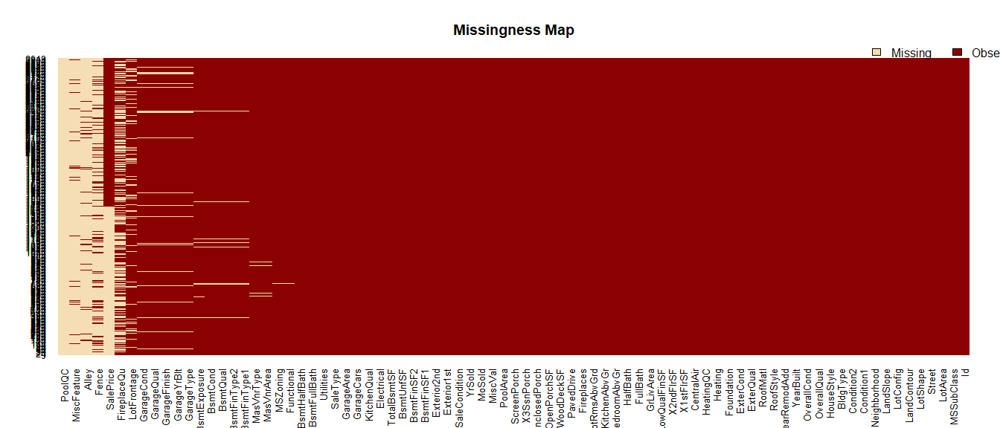
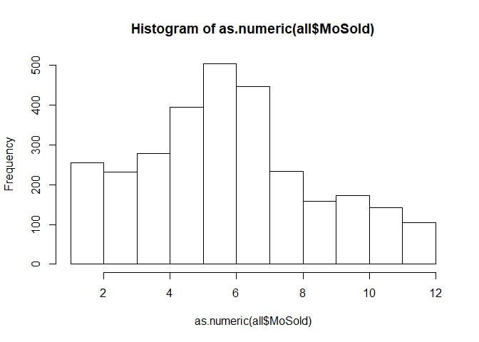

Predicting House Sale Prices
================
Göksu Yıldırım

------------------------------------------------------------------------

### **Setting Up**

Loading required libraries

``` r
library(Amelia)
library(mice)
library(rpart)
library(car)
library(Matrix)
library(xgboost)
library(caret)
library(randomForest)
library(dplyr)
library(Ckmeans.1d.dp)
```

Loading datasets and combining them for easier missing value handling & feature engineering.

``` r
test <- read.csv("test.csv", header = TRUE)
train <- read.csv("train.csv", header = TRUE)
test <- cbind(test, SalePrice = NA)
all <- rbind(train, test)
```

Factorizing some non-numeric variables that have been loaded as numeric

``` r
all$YearRemodAdd <- as.factor(all$YearRemodAdd)
all$GarageYrBlt <- as.factor(all$GarageYrBlt)
all$MoSold <- as.factor(all$MoSold)
all$YrSold <- as.factor(all$YrSold)
all$YearBuilt <- as.factor(all$YearBuilt)
all$YearRemodAdd <- as.factor(all$YearRemodAdd)
```

### **Missing Values**

``` r
missmap(all)
```

 <br> <br> We have quite bit of columns with no or very few missing data:

-   PoolQC, MiscFeature, Alley, Fence seem to be missing over half of their values
-   There are several columns that seem to be missing together:
    -   One such group is: GarageCond, -Qual, -Finish, -YrBlt, -Type. The missing cases are probably houses without garages.
    -   The second group is: BsmtCond, - Qual- FinType2, -FiType1. So, probably houses without basement.

Let's start with features that are straightforward to deal with, mostly because they have only a few missing values and/or a clearly dominant factor level.

``` r
all[is.na(all$MSZoning), "MSZoning"] <- "RL"
all[is.na(all$Utilities), "Utilities"] <- "AllPub"
all[is.na(all$Exterior1st), "Exterior1st"] <- "VinylSd"
all[is.na(all$Exterior2nd), "Exterior2nd"] <- "VinylSd"
all[is.na(all$BsmtFinSF1), "BsmtFinSF1"] <- mean(all[!is.na(all$BsmtFinSF1), "BsmtFinSF1"])
all[is.na(all$BsmtFinSF2), "BsmtFinSF2"] <- mean(all[!is.na(all$BsmtFinSF2), "BsmtFinSF2"])
all[is.na(all$BsmtUnfSF), "BsmtUnfSF"] <- mean(all[!is.na(all$BsmtUnfSF), "BsmtUnfSF"])
all$TotalBsmtSF <- all$BsmtFinSF1 + all$BsmtFinSF2 + all$BsmtUnfSF
all[is.na(all$Electrical), "Electrical"] <- "SBrkr"
all[is.na(all$BsmtFullBath), "BsmtFullBath"] <- "0"
all[is.na(all$BsmtHalfBath), "BsmtHalfBath"] <- "0"
all[is.na(all$KitchenQual), "KitchenQual"] <- "TA"
all[is.na(all$Functional), "Functional"] <- "Typ"
all[is.na(all$GarageCars), "GarageCars"] <- "2"
all[is.na(all$GarageArea), "GarageArea"] <- mean(all[!is.na(all$GarageArea), "GarageArea"])
all[is.na(all$SaleType), "SaleType"] <- "WD"
```

Now onto the kinkier ones.

``` r
all[is.na(all$GarageYrBlt), c("GarageType", "GarageYrBlt", "GarageFinish", "GarageQual", "GarageCond")]
```

Almost all garage related columns have the same number of NAs. The above line shows that those NAs indeed belong to same cases.

My assumption was that those houses didn't have a garage.

``` r
all[is.na(all$GarageType), c("GarageType", "GarageYrBlt", "GarageFinish", "GarageQual", "GarageCond")] <- "None"
```

``` r
all[is.na(all$GarageFinish), "GarageFinish"] <- "Unf"
all[is.na(all$GarageCond), "GarageCond"] <- "TA"
all[is.na(all$GarageQual), "GarageQual"] <- "TA"
all[is.na(all$GarageYrBlt), "GarageYrBlt"] <- all[is.na(all$GarageYrBlt), "YearBuilt"]
```

Same deal with basement related columns

``` r
all[is.na(all$BsmtCond), c("BsmtQual", "BsmtCond", "BsmtExposure", "BsmtFinType1", "BsmtFinType2")] 
```

``` r
all[is.na(all$BsmtCond) & is.na(all$BsmtQual) & is.na(all$BsmtExposure) & is.na(all$BsmtFinType1) & is.na(all$BsmtFinType2), c("BsmtQual", "BsmtCond", "BsmtExposure", "BsmtFinType1", "BsmtFinType2")] <- "None" 
```

``` r
all[is.na(all$BsmtCond), "BsmtCond"] <- "TA"
all[is.na(all$BsmtQual), "BsmtQual"] <- "TA"
all[is.na(all$BsmtExposure), "BsmtExposure"] <- "No"
all[is.na(all$BsmtFinType2), "BsmtFinType2"] <- "Unf"
```

Manually filling some missing values

``` r
all[is.na(all$MasVnrArea), "MasVnrType"] <- "None"
all[is.na(all$MasVnrArea), "MasVnrArea"] <- 0
all[is.na(all$MasVnrType), "MasVnrType"] <- "BrkFace"

sum((all[is.na(all$FireplaceQu), "Fireplaces"]))
all$FireplaceQu <- as.character(all$FireplaceQu)
all[is.na(all$FireplaceQu), "FireplaceQu"] <- "None"
all$FireplaceQu <- as.factor(all$FireplaceQu)

length(all[!all$PoolArea==0, "PoolArea"]) #Only 13 houses have pools
all[(sample(nrow(all[is.na(all$PoolQC),]), 1)), "PoolQC"] <- "Ex"
all[(sample(nrow(all[is.na(all$PoolQC),]), 1)), "PoolQC"] <- "Fa"
all[(sample(nrow(all[is.na(all$PoolQC),]), 1)), "PoolQC"] <- "Gd"

all$PoolQC <- as.character(all$PoolQC)
all[is.na(all$PoolQC), "PoolQC"] <- "None"
all$PoolQC <- as.factor(all$PoolQC)
```

``` r
prop.table(table(is.na(all$LotFrontage), all$LotShape), 2)
```

    ##        
    ##                IR1        IR2        IR3        Reg
    ##   FALSE 0.66838843 0.63157895 0.68750000 0.92899408
    ##   TRUE  0.33161157 0.36842105 0.31250000 0.07100592

LotFrontage seems like it might be linkted to LotShape as the most common Shape has a very significanly few missing values. Indicating a missing-at-random situation.

Using CART regression to impute missing LotFrontage values.

``` r
lotf_fit <- rpart(LotFrontage~., data=all[!is.na(all$LotFrontage),], method="anova")
all[is.na(all$LotFrontage),"LotFrontage"] <- predict(lotf_fit, all[is.na(all$LotFrontage),])
```

``` r
all[all$MiscVal > 0, c("MiscFeature", "MiscVal")]
```

My assumption is that a lack of info on MiscFeature means there are no miscfeatures for the house. This assumption is supported by that almost each MiscFeature has an associated MiscVal and NAs are met with a 0 in MiscValue. There are barely any MiscFeatures without a positive value. <br> There is a single MiscFeature missing to which a MiscValue is defined. The value suggests it's a Gar2.

``` r
all[is.na(all$MiscFeature), "MiscFeature"] <- "None"
all[all$MiscVal==17000, "MiscFeature"] <- "Gar2"
```

I will be leaving "Fence" and "Alley" out of the model since they are missing over 80% of their values. I believe we can not safely assume the nature of their absence.

``` r
storage <- data.frame(Fence = all$Fence, Alley = all$Alley)
all$Fence <- c()
all$Alley <- c()
```

### **Feature Engineering**

Combining all features that represent the area of a certain part to create the **TotalArea** feature:

``` r
all$TotalArea <- all$LotArea + all$TotalBsmtSF + all$X1stFlrS + all$GarageArea + all$WoodDeckSF + all$OpenPorchSF + all$EnclosedPorch + all$X3SsnPorch + all$ScreenPorch + all$PoolArea
```

Creating **Age** feature to represent the age of the building at the time of sale

``` r
all$Age <- (as.numeric(as.character(all$YrSold)) - as.numeric(as.character(all$YearBuilt)))
```

Also creating **PorchSF** to consolidate all porch areas under a single feature and drop individual features.

``` r
all$PorchSF <- all$OpenPorchSF + all$X3SsnPorch + all$EnclosedPorch + all$EnclosedPorch
```

I think the demand and therefore the prices might be effected by seasonality.

``` r
hist(as.numeric(all$MoSold)) 
```

 Indeed, the seasons clearly effect the amount of house sales. We can say that April to June is the hottest season to buy a house. Followed by January to March and July. Creating **BuyingSeason** to rank different demand seasons for houses.

``` r
all$BuyingSeason <- 1
all[all$MoSold %in% c(1,2,3,7), "BuyingSeason"] <- 2
all[all$MoSold %in% c(4,5,6), "BuyingSeason"] <- 3
```

Calculating how many rooms need share one bathroom to create the **RoomPerBath** feature:

``` r
all$RoomPerBath <- as.numeric(as.character(all$TotRmsAbvGrd)) / (as.numeric(as.character(all$BsmtFullBath)) + 0.5*as.numeric(all$BsmtHalfBath))
```

Creating the logical **IsModelled** feature to label remodelled houses.

``` r
all$IsRemodelled <- TRUE
all[all$YearBuilt == all$YearRemodAdd, "IsRemodelled"] <- FALSE
```

Adding **AgeBeforeRemodel** to see how old a building was when it got remodelled. I felt like adding this feature because I think a remodelling that is very close to actual build date might mean a serious flaw in the initial build.

``` r
all$AgeBeforeRemodel <- all$YearRemodAdd - all$YearBuilt
summary(all$AgeBeforeRemodel)
```

    ##    Min. 1st Qu.  Median    Mean 3rd Qu.    Max. 
    ##   -1.00    0.00    0.00   12.95   18.00  127.00

``` r
all[all$AgeBeforeRemodel == -1,]
```

    ##        Id MSSubClass MSZoning LotFrontage LotArea Street LotShape
    ## 1877 1877         20       RL          65   10739   Pave      IR1
    ##      LandContour Utilities LotConfig LandSlope Neighborhood Condition1
    ## 1877         Lvl    AllPub    Inside       Gtl      CollgCr       Norm
    ##      Condition2 BldgType HouseStyle OverallQual OverallCond YearBuilt
    ## 1877       Norm     1Fam     1Story           7           5      2002
    ##      YearRemodAdd RoofStyle RoofMatl Exterior1st Exterior2nd MasVnrType
    ## 1877         2001     Gable  CompShg     VinylSd     VinylSd    BrkFace
    ##      MasVnrArea ExterQual ExterCond Foundation BsmtQual BsmtCond
    ## 1877         68        Gd        TA      PConc       Gd       TA
    ##      BsmtExposure BsmtFinType1 BsmtFinSF1 BsmtFinType2 BsmtFinSF2
    ## 1877           No          GLQ       1259          Unf          0
    ##      BsmtUnfSF TotalBsmtSF Heating HeatingQC CentralAir Electrical
    ## 1877       172        1431    GasA        Ex          Y      SBrkr
    ##      X1stFlrSF X2ndFlrSF LowQualFinSF GrLivArea BsmtFullBath BsmtHalfBath
    ## 1877      1444         0            0      1444            1            0
    ##      FullBath HalfBath BedroomAbvGr KitchenAbvGr KitchenQual TotRmsAbvGrd
    ## 1877        2        0            3            1          Gd            6
    ##      Functional Fireplaces FireplaceQu GarageType GarageYrBlt GarageFinish
    ## 1877        Typ          0        None     Attchd        2002          RFn
    ##      GarageCars GarageArea GarageQual GarageCond PavedDrive WoodDeckSF
    ## 1877          2        577         TA         TA          Y        144
    ##      OpenPorchSF EnclosedPorch X3SsnPorch ScreenPorch PoolArea PoolQC
    ## 1877          40             0          0           0        0   None
    ##      MiscFeature MiscVal MoSold YrSold SaleType SaleCondition SalePrice
    ## 1877        None       0      4   2009       WD        Normal        NA
    ##      TotalArea Age PorchSF BuyingSeason RoomPerBath IsRemodelled
    ## 1877     14375   7      40            3           6         TRUE
    ##      AgeBeforeRemodel
    ## 1877               -1

Oops, we got a house that was remodelled before it was built. Most plausible possibility is that building year and remodelling year got mixed up.

``` r
all[all$AgeBeforeRemodel == -1, "YearBuilt"] <- "2001"
all[all$AgeBeforeRemodel == -1, "YearRemodAdd"] <- "2002"
```

Binning the rare factor levels in certain feature under *"Other"*

``` r
all[all$LotShape %in% c("IR2", "IR3"), "LotShape"] <- "Other"
all[all$LotConfig %in% c("CulDSac", "FR2", "FR3"), "LotConfig"] <- "Other"
all[!all$RoofStyle %in% c("Gable", "Hip"), "RoofStyle"] <- "Other"
all[all$Foundation %in% c("Slab", "Stone", "Wood"), "Foundation"] <- "Other"
all[!all$Exterior1st %in% c("CemntBd", "HdBoard", "MetalSd", "Plywood", "VinylSd", "Wd Sdng"), "Exterior1st"] <- "Other"
all[!all$Exterior2nd %in% c("CmentBd", "HdBoard", "MetalSd", "Plywood", "VinylSd", "Wd Sdng"), "Exterior2nd"] <- "Other"
```

Adding logical features related to features that have a strong dominant factor to tag houses that have *odd* properties (=properties that differ from usual)

``` r
all$SlopeIsGtl <- FALSE
all[all$LandSlope == "Gtl", "SlopeIsGtl"] <- TRUE

all$IsLevel <- FALSE
all[all$LandContour == "Lvl", "IsLevel"] <- TRUE

all$Is1Story <- FALSE
all[all$HouseStyle == "1Story", "Is1Story"] <- TRUE

all$RoofMatlComShg <- FALSE
all[all$RoofMatl == "CompShg", "RoofMatlComShg"] <- TRUE

all$IsHeatingGasA <- FALSE
all[all$Heating == "GasA", "IsHeatingGasA"] <- TRUE

all$HasFireplace <- FALSE
all[all$Fireplaces > 0, "HasFireplace"] <- TRUE

all$HasMasVnr <- FALSE
all[all$MasVnrArea > 0, "HasMasVnr"] <- TRUE

all$IsCondition1Norm <- FALSE
all[all$Condition1 == "Norm", "IsCondition1Norm"] <- TRUE

all$IsCondition2Norm <- FALSE
all[all$Condition2 == "Norm", "IsCondition2Norm"] <- TRUE

all$IsBldgType1Fam <- FALSE
all[all$BldgType == "1Fam", "IsBldgType1Fam"] <- TRUE

all$HasPool <- FALSE
all[!all$PoolArea == 0, "HasPool"] <- TRUE
```

**Preparing Data for Modelling**
--------------------------------

I will be using XGBoost for predicting the sale prices. XGBoost requires a numerical input to work. Therefore I need to turn my categoric variables into numeric where I can and create dummy variables for the rest. <br> Recoding factors that represent a score to a numeric equivalent:

``` r
all$ExterQual<- recode(all$ExterQual,"None"=0,"Po"=1,"Fa"=2,"TA"=3,"Gd"=4,"Ex"=5)
all$ExterCond<- recode(all$ExterCond,"None"=0,"Po"=1,"Fa"=2,"TA"=3,"Gd"=4,"Ex"=5)
all$BsmtQual<- recode(all$BsmtQual,"None"=0,"Po"=1,"Fa"=2,"TA"=3,"Gd"=4,"Ex"=5)
all$BsmtCond<- recode(all$BsmtCond,"None"=0,"Po"=1,"Fa"=2,"TA"=3,"Gd"=4,"Ex"=5)
all$BsmtExposure<- recode(all$BsmtExposure,"None"=0,"No"=1,"Mn"=2,"Av"=3,"Gd"=4)
all$BsmtFinType1<- recode(all$BsmtFinType1,"None"=0,"Unf"=1,"LwQ"=2,"Rec"=3,"BLQ"=4,"ALQ"=5,"GLQ"=6)
all$BsmtFinType2<- recode(all$BsmtFinType2,"None"=0,"Unf"=1,"LwQ"=2,"Rec"=3,"BLQ"=4,"ALQ"=5,"GLQ"=6)
all$HeatingQC<- recode(all$HeatingQC,"None"=0,"Po"=1,"Fa"=2,"TA"=3,"Gd"=4,"Ex"=5)
all$KitchenQual<- recode(all$KitchenQual,"None"=0,"Po"=1,"Fa"=2,"TA"=3,"Gd"=4,"Ex"=5)
all$Functional<- recode(all$Functional,"None"=0,"Sev"=1,"Maj2"=2,"Maj1"=3,"Mod"=4,"Min2"=5,"Min1"=6,"Typ"=7)
all$FireplaceQu<- recode(all$FireplaceQu,"None"=0,"Po"=1,"Fa"=2,"TA"=3,"Gd"=4,"Ex"=5)
all$GarageFinish<- recode(all$GarageFinish,"None"=0,"Unf"=1,"RFn"=2,"Fin"=3)
all$GarageQual<- recode(all$GarageQual,"None"=0,"Po"=1,"Fa"=2,"TA"=3,"Gd"=4,"Ex"=5)
all$GarageCond<- recode(all$GarageCond,"None"=0,"Po"=1,"Fa"=2,"TA"=3,"Gd"=4,"Ex"=5)
all$PoolQC<- recode(all$PoolQC,"None"=0,"Po"=1,"Fa"=2,"TA"=3,"Gd"=4,"Ex"=5)
```

Last check & fixes:

``` r
lapply(all,class)
all$MSSubClass <- as.factor(all$MSSubClass)
all$IsRemodelled <- as.factor(all$IsRemodelled)
```

Creating seperate data frames with numeric(+integer) and factor(+logical) features.

``` r
numerics <- all[,lapply(all, class)=="numeric"]
integers <- all[,lapply(all, class)=="integer"]
integers <- as.data.frame(sapply(integers, as.numeric))
integers$SalePrice <- c()
integers$Id <- c()
numerics <- cbind(numerics, integers)

categorics <- all[,lapply(all, class)=="factor"]
logicals <- all[,lapply(all, class)=="logical"]
logicals <- as.data.frame(sapply(logicals, as.factor))
categorics <- cbind(categorics, logicals)
categorics$MSSubClass <- as.factor(all$MSSubClass)
```

Creating dummy variables for remaining factors and binding them back together with numeric features to create the final version of the *all* data frame.

``` r
catToDummy <- as.data.frame(model.matrix(~.-1, categorics))
all_dummied <- cbind(numerics, catToDummy)
```

Seperating train and test sets.

``` r
train_xgb <- all_dummied[!is.na(all$SalePrice),]
test_xgb <- all_dummied[is.na(all$SalePrice),]
```

**Modelling**
-------------

I will be using the XGBoost algorithm from the xgboost package with default parameters and a 10-fold cross validation to determine the optimum number of rounds.

``` r
train_label <- all$SalePrice[!is.na(all$SalePrice)]

dtrain <- xgb.DMatrix(data = as.matrix(train_xgb), label= train_label)
dtest <- xgb.DMatrix(data = as.matrix(test_xgb))

default_param <-list (
        objective = "reg:linear",
        booster = "gbtree",
        eta=0.1,
        gamma=0,
        max_depth=6,
        min_child_weight=1,
        subsample=1,
        colsample_bytree=1 
      )

xgbcv <- xgb.cv(params = default_param, data = dtrain, nrounds = 500, nfold = 10, showsd = T, stratified = T, print_every_n = 40, early_stopping_rounds = 10, maximize = F)

xgb_mod <- xgb.train(data = dtrain, params=default_param, nrounds = xgbcv$best_iteration)
```

Let's take a look at the top 20 important features for our prediction

``` r
mat <- xgb.importance (feature_names = colnames(train_xgb),model = xgb_mod)
xgb.ggplot.importance(importance_matrix = mat[1:20], rel_to_first = TRUE)
```


``` r
head(mat[, c("Feature", "Gain")], n=20)
```

    ##          Feature        Gain
    ##  1:  OverallQual 0.647036980
    ##  2:    GrLivArea 0.099059705
    ##  3:  TotalBsmtSF 0.037355716
    ##  4:   BsmtFinSF1 0.033151992
    ##  5:    TotalArea 0.026801405
    ##  6:     BsmtQual 0.024459745
    ##  7:  KitchenQual 0.015256222
    ##  8:   GarageArea 0.012261161
    ##  9:          Age 0.011764178
    ## 10:    X2ndFlrSF 0.009525021
    ## 11:    X1stFlrSF 0.009302190
    ## 12:  FireplaceQu 0.005716108
    ## 13:  OverallCond 0.005311237
    ## 14:  LotFrontage 0.004464999
    ## 15: TotRmsAbvGrd 0.004087480
    ## 16:  CentralAirY 0.002975212
    ## 17:    BsmtUnfSF 0.002649693
    ## 18: GarageFinish 0.002408023
    ## 19: BsmtExposure 0.002369781
    ## 20:  OpenPorchSF 0.002242905

So the OverallQuality feature is without a doubt the leading force behind our predictions. This is not really a surprise however I would have expected the area related features to have a bigger impact.

Fitting the model and creating the Kaggle submission file:

``` r
XGBpred <- predict(xgb_mod, dtest)
Submission <- data.frame(Id = 1461:2919, SalePrice = XGBpred)
write.csv(Submission, file="submission_xgb.csv", row.names = FALSE)
```

**Final Score:** 0.13743

*Submissions are evaluated on Root-Mean-Squared-Error (RMSE) between the logarithm of the predicted value and the logarithm of the observed sales price.*

**How to improve?**
-------------------

There are a lot of things that can be done to improve above prediction.

-   **Feature selection:** The saying goes "Garbage in, garbage out". In my model, I threw almost every feature available to me into the model. Reducing the number of features by removing redundant and unnecessary features would be one way to improve the model.
    -   **Multicollinearity:** Although XGBoost can handle *multicollinearity*, it would have been even better not to feed the model with a feature set with multicollinearity in the first place. <br> <br>
-   **Skewness & Normalization:** Since I am using the tree based *gbtree* booster for my XGBoost model, as far as I know there is no normality assumption that applies to my data. However normalization seems to be a common practice among high performing kernels. So it might be worth looking into. <br> <br>
-   **Hyperparameter Tuning:** With the exception of *eta* I used default values for XGBoost parameters. Finding optimal valus would improve model performance. <br> <br>
-   **Exploratory Analysis & Data Visualization:** I could have definitely done more exploratory data analysis to uncover some more insights that could have helped me with feature engineering. <br> <br>
-   **Outliers & Errors:** I fixed a few errors I came across such as the house with a built year 2207. There are definitely more that could be fixed, for example there is a house with a negative age that I just let pass. Looking into fixing these would improve data quality, therefore model performance.
