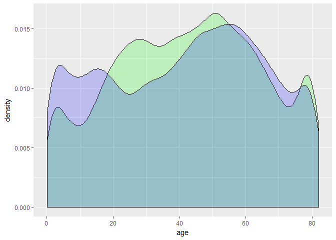
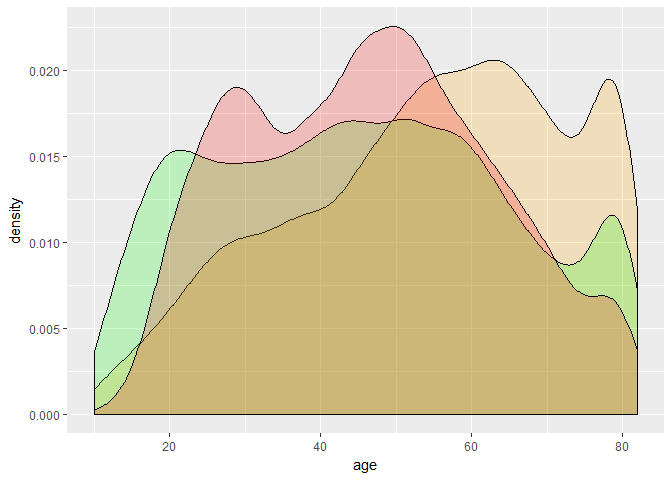
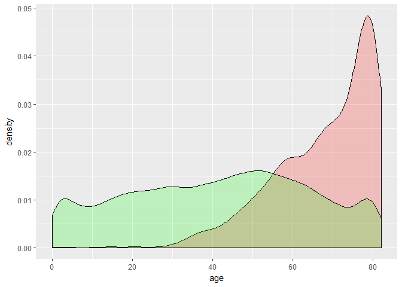
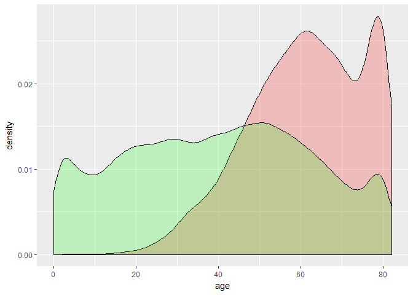
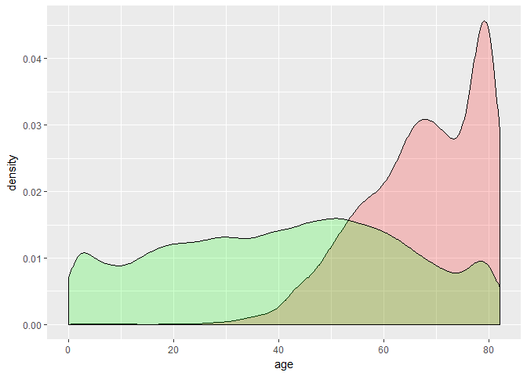
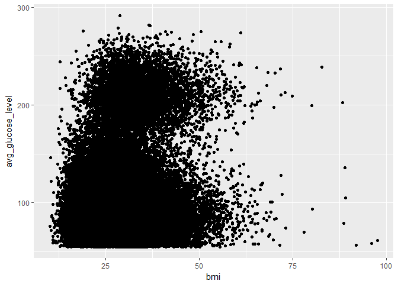
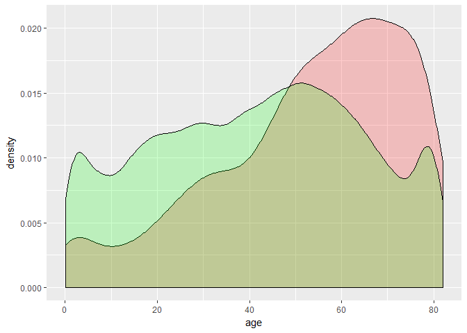
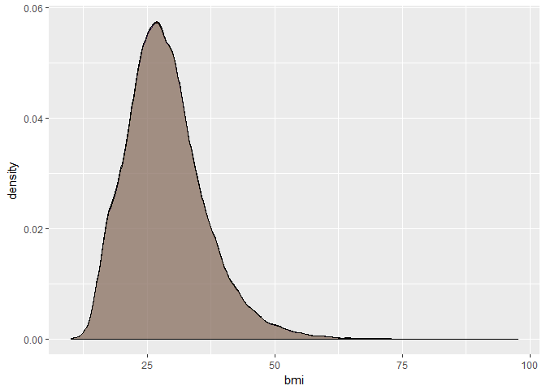
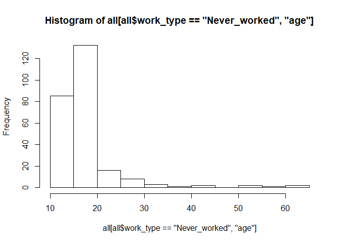
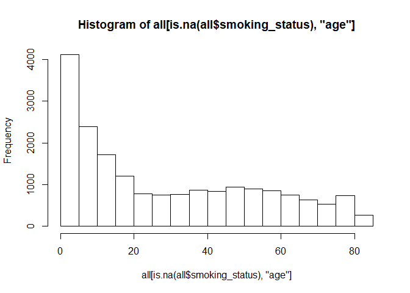

McKinsey Hackathon - Stroke Prediction
================
Göksu Yıldırım

*Using labeled patient data to predict possibility of a stroke for individual patients.*

My submission to McKinsey’s 24-hour online hackathon. A probabilistic classification problem solved using conditional random forest. Earned an AUCROC score of 0.847, while the winning submission got 0.860.

------------------------------------------------------------------------

### **Setting Up**

Loading required libraries

``` r
library(ggplot2)
library(tidyr)
library(rpart)
library(randomForest)
library(party)
library(mice)
library(party)
library(gridExtra)
```

Loading datasets and combining them for easier missing value handling & feature engineering. Factorizing some non-numeric variables that have been loaded as numeric

``` r
train <- read.csv("train_mk_hc.csv", header = TRUE, stringsAsFactors = TRUE)
test <- read.csv("test_mk_hc.csv", header = TRUE, stringsAsFactors = TRUE)

test$stroke <- NA
all <- rbind(train,test)

all$hypertension <- as.factor(all$hypertension)
all$heart_disease <- as.factor(all$heart_disease)
all$stroke <- as.factor(all$stroke)
```

### **Exploratory Analysis**

``` r
summary(all)
```

    ##        id           gender           age        hypertension heart_disease
    ##  Min.   :    1   Female:36622   Min.   : 0.08   0:56207      0:59045      
    ##  1st Qu.:18187   Male  :25366   1st Qu.:24.00   1: 5794      1: 2956      
    ##  Median :36463   Other :   13   Median :44.00                             
    ##  Mean   :36453                  Mean   :42.17                             
    ##  3rd Qu.:54693                  3rd Qu.:60.00                             
    ##  Max.   :72943                  Max.   :82.00                             
    ##                                                                           
    ##  ever_married         work_type     Residence_type avg_glucose_level
    ##  No :22124    children     : 8769   Rural:30935    Min.   : 55.00   
    ##  Yes:39877    Govt_job     : 7742   Urban:31066    1st Qu.: 77.54   
    ##               Never_worked :  252                  Median : 91.66   
    ##               Private      :35584                  Mean   :104.45   
    ##               Self-employed: 9654                  3rd Qu.:112.12   
    ##                                                    Max.   :291.05   
    ##                                                                     
    ##       bmi                smoking_status   stroke     
    ##  Min.   :10.10                  :19043   0   :42617  
    ##  1st Qu.:23.20   formerly smoked:10753   1   :  783  
    ##  Median :27.70   never smoked   :22886   NA's:18601  
    ##  Mean   :28.59   smokes         : 9319               
    ##  3rd Qu.:32.80                                       
    ##  Max.   :97.60                                       
    ##  NA's   :2053

``` r
all[all$smoking_status=="", "smoking_status"] <- NA
```

bmi & smoking\_status have NA / blank values. They respectively have about 3.3% and 31% missing value ratio.

``` r
all[all$gender == "Other",]
```

Among people with the 'Other' gender we have 4 children which makes me think if 'Other' partially or fully used to indicate missing gender data, rather than a gender besides male/female.

``` r
ggplot(all, aes(x=age)) + 
  geom_density(data=all[all$gender=="Female",], fill="green", alpha=0.2) + 
  geom_density(data=all[all$gender=="Male",], fill="blue", alpha=0.2)
```

 In 20-50 age bracket we have more cases for Female patients while until ~20 the amount of cases for Male patients is superior.

``` r
prop.table(table(all$heart_disease, all$smoking_status),2)
```

    ##    
    ##      formerly smoked never smoked     smokes
    ##   0       0.91304752   0.96233505 0.93497156
    ##   1       0.08695248   0.03766495 0.06502844

``` r
prop.table(table(all$hypertension, all$smoking_status),2)
```

    ##    
    ##      formerly smoked never smoked    smokes
    ##   0        0.8631080    0.8899764 0.8893658
    ##   1        0.1368920    0.1100236 0.1106342

``` r
prop.table(table(train$stroke, train$smoking_status),2)
```

    ##    
    ##                formerly smoked never smoked     smokes
    ##   0 0.98909118      0.97050581   0.98230860 0.97973179
    ##   1 0.01090882      0.02949419   0.01769140 0.02026821

Looking at the relation between smoking status and having hypertension/heart\_disease, results are pretty counter-intuitive.<br> For all health problems, former smokers seem to have the highest ratio of sick people. <br> For hypertension, people who never smoked and people who smoke have a very similar ratio of sick people.<br> One explanation of this could be a high number of smokers who had to quit after diagnosis.

``` r
ggplot(all, aes(x=age)) +
 geom_density(data=all[all$smoking_status=="formerly smoked",], fill="orange", alpha=0.2) +
 geom_density(data=all[all$smoking_status=="never smoked",], fill="green", alpha=0.2) +
 geom_density(data=all[all$smoking_status=="smokes",], fill="red", alpha=0.2)
```

 Amount of smokers tend to fall with age after age of 50 while the amount of former smokers reach it's peak.

``` r
ggplot(train, aes(x=age)) + 
  geom_density(data=train[train$stroke=="1",], fill="red", alpha=0.2) + 
  geom_density(data=train[train$stroke=="0",], fill="green", alpha=0.2)
```

 Stroke possibility dramatically increases with age. However, interestingly, it starts falling after about 76 years old. Age will probably one of the, if not the, most important featrures.

``` r
ggplot(all, aes(x=age)) + 
  geom_density(data=all[all$hypertension=="1",], fill="red", alpha=0.2) + 
  geom_density(data=all[all$hypertension=="0",], fill="green", alpha=0.2)
```



``` r
ggplot(all, aes(x=age)) + 
  geom_density(data=all[all$heart_disease=="1",], fill="red", alpha=0.2) + 
  geom_density(data=all[all$heart_disease=="0",], fill="green", alpha=0.2)
```

 As expected hypertension and heart disease are also more prominent among older people.

``` r
ggplot(all, aes(x=bmi, y=avg_glucose_level)) + 
  geom_point()
```

 There is no obvious relation between avg\_glucose\_level and bmi.

### **Missing Values**

#### BMI

``` r
ggplot(all, aes(x=age)) +
  geom_density(data=all[is.na(all$bmi),], fill="red", alpha=0.2) +
  geom_density(data=all[!is.na(all$bmi),], fill="green", alpha=0.2)
```

 Missing bmi gets more frequent with increasing age, thus I conclude again on a missing-at-random case. I will be using predictive mean matching from mice package to impute missing values.

``` r
temp_bmi <- mice(all[, !names(all) %in% c("stroke", "id", "name", "bmi_rpart")], m=5, maxit = 5, method="pmm", seed=17)
```

Plotting imputed values to select the one that is closest to our current bmi distribution.

``` r
ggplot(all, aes(x=bmi)) +
  geom_density(fill="black", alpha=0.2) +
  geom_density(data=data.frame(all$id, mice::complete(temp_bmi,1)), fill="blue", alpha=0.2) +
  geom_density(data=data.frame(all$id, mice::complete(temp_bmi,2)), fill="red", alpha=0.2) +
  geom_density(data=data.frame(all$id, mice::complete(temp_bmi,3)), fill="green", alpha=0.2) +
  geom_density(data=data.frame(all$id, mice::complete(temp_bmi,4)), fill="yellow", alpha=0.2) +
  geom_density(data=data.frame(all$id, mice::complete(temp_bmi,5)), fill="purple", alpha=0.2)
```



``` r
all$bmi <- mice::complete(temp_bmi,2)$bmi
```

#### Smoking Status

``` r
prop.table(table(is.na(all$smoking_status), all$gender),2)
```

    ##        
    ##            Female      Male     Other
    ##   FALSE 0.7133417 0.6632894 0.6923077
    ##   TRUE  0.2866583 0.3367106 0.3076923

``` r
prop.table(table(is.na(all$smoking_status), all$Residence_type),2)
```

    ##        
    ##             Rural     Urban
    ##   FALSE 0.6922903 0.6934269
    ##   TRUE  0.3077097 0.3065731

``` r
prop.table(table(is.na(all$smoking_status), all$work_type),2) 
```

    ##        
    ##           children   Govt_job Never_worked    Private Self-employed
    ##   FALSE 0.09773064 0.79837251   0.56349206 0.78872527    0.79883986
    ##   TRUE  0.90226936 0.20162749   0.43650794 0.21127473    0.20116014

``` r
hist(all[all$work_type=="Never_worked", "age"]) 
```



``` r
hist(all[is.na(all$smoking_status), "age"])
```



The missing value ratio for smoking\_status is higher for people under 20. This indicates a missing-at-random case. Using decision tree for imputation.

``` r
smoking_fit <- rpart(smoking_status ~ gender + age + hypertension + heart_disease + ever_married + work_type + Residence_type + avg_glucose_level + bmi, data=all[!is.na(all$smoking_status),], method="class")
all$smoking_status[is.na(all$smoking_status)] <- predict(smoking_fit, all[is.na(all$smoking_status),], type="class")
```

### **Feature Engineering**

Ok, first and foremost I need some domain knowledge before making up features of our own. Finding and reading some articles about causes of stroke via Google suggest that, to no surprise, *hypertension, smoking, and cardiovascular diseases* as common risk factors for a stroke. The articles also often mention **diabetes** and **high cholesterol** as an important health factor that increases the chance of a stroke. <br> <br> For the former three risk factor I already have corresponding features. For **diabetes** I have the next best thing: average glucose levels of patients! Some more Google search and article reading suggests that an average blood glucose level of equal or more than 200 is used for diabetes diagnosis. So that's the number I will be using when creating the **diabetes** feature.

``` r
all$diabetes <- FALSE
all[all$avg_glucose_level >= 200, "diabetes"] <- TRUE
all$diabetes <- as.factor(all$diabetes)
```

<br><br> Before creating a feature for **high cholesterol**, I want to create **categories for BMI values**. I took the cut off values for categories from U.S NHLBI website.

``` r
all$bmi_category <- ""
all[all$bmi >= 30, "bmi_category"] <- "obese"
all[all$bmi < 30, "bmi_category"] <- "overweight"
all[all$bmi < 25, "bmi_category"] <- "normal"
all[all$bmi < 18.5, "bmi_category"] <- "underweight"
all$bmi_category <- as.factor(all$bmi_category)
```

<br><br> Now, about high cholesterol. One thing about the BMI values from NHLBI website is that they take only height and weight into account. So a very fit bodybuilder with a high muscle mass might be categorized as overweight of obese because of his/her weight. I will be ignoring this exceptional case when working with BMI categories. Why is this important? Because I as an indicator of high cholesterol, I will be grouping obese and overweight patients under the feature **isOverweight**.

``` r
all$isOverweight <- FALSE
all[all$bmi_category %in% c("obese","overweight"), "isOverweight"] <- TRUE
all$isOverweight <- as.factor(all$isOverweight)
```

Another feature I would like to create is counter that shows how many of these high risk factors an individual patient has, since I believe each added one from this five would dramatically increase the risk of a stroke.

``` r
all$condition_count <- 0
all[all$hypertension==1, "condition_count"] <- all[all$hypertension==1,"condition_count"]+1
all[all$heart_disease==1, "condition_count"] <- all[all$heart_disease==1, "condition_count"]+1
all[all$isOverweight==1, "condition_count"] <- all[all$isOverweight==1, "condition_count"]+1
all[all$diabetes==1, "condition_count"] <- all[all$diabetes==1, "condition_count"]+1
all[all$smoking_status %in% c("formerly smoked", "smokes"), "condition_count"] <- all[all$smoking_status %in% c("formerly smoked", "smokes"), "condition_count"]+1
all$condition_count <- as.factor(all$condition_count)
```

Also, I would like to have a feature that shows if the individual is under high stress, because it's an important factor in everything health related :) I'm assuming people that are self-employed or working at private sector and living in rural areas are under higher stress than the rest of our group.

``` r
all$high_stress <- FALSE
all[all$work_type %in% c("private", "Self-employed") & all$Residence_type=="Rural", "high_stress"] <- TRUE
all$high_stress <- as.factor(all$high_stress)
```

### **Prediction**

I will be using the conditional random forest algorithm that creates a random forest with conditional inference trees. I will start with all my features and decide which features to use in the final model using backward elimination.

#### Seperating combined data set to train and test sets

``` r
train <- all[1:43400,]
test <- all[43401:62001,]
```

#### Final Model and fitting

``` r
crf <- cforest(stroke ~ gender + age + ever_married + work_type + 
                 avg_glucose_level + bmi + hypertension + heart_disease + 
                 Residence_type + smoking_status + diabetes + isOverweight + 
                 condition_count, data=train, controls=cforest_unbiased(ntree=50, mtry=3))

Prediction_crf <- predict(crf, test, OOB=TRUE, type = "prob")
```

<br> <br>

#### Creating the submission file

``` r
Prediction_crf <- predict(crf, test, OOB=TRUE, type = "prob")
submission_file_crf <- data.frame(id = test$id, stroke = sapply(Prediction_crf, "[[", 2))
write.csv(submission_file_crf, file = "crf.csv", row.names = FALSE)
```

**Final AUCROC Score:** 0.847

### **Closing Words**

Overall, I am pretty satisfied with the final result, considering this was my second project ever, after Kaggle's infamous Titanic exercise. <br> <br> In terms of handling missing values and feature engineering I believe I did well. Researching about the topic and then using that new domain knowledge to create the *diabetes* feature from the existing *average glucose level* feature was impactful. Also to be honest, a really satisfactory feeling :) <br> <br> One thing I could have done a lot better was model **selection & optimization**. Other than conditional random forest, I only tried a regular random forest. I tried using XGBoost but failed because, well, I had never used it before and tried to learning during the final quarter of the hackathon. So I trying different models and selecting the best performing one as well as proper hyperparameter tuning could have gotten me a lot better score, possibly even the first place :) <br> <br> Lastly, **cross validation**. I didn't use it because at the time of the competition I didn't know about it. It could have improved my feature selection process significantly.
