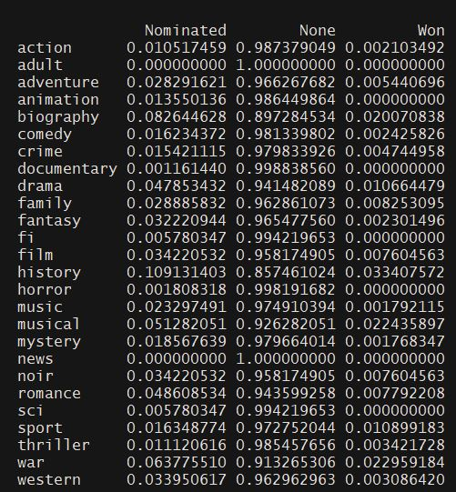
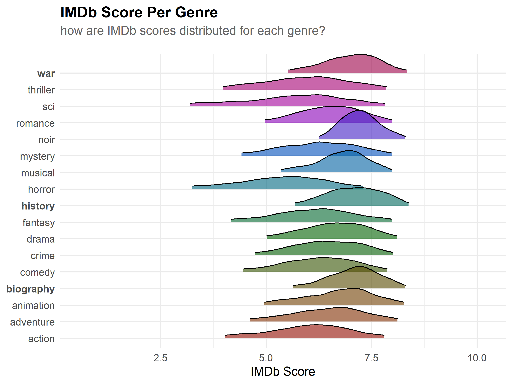
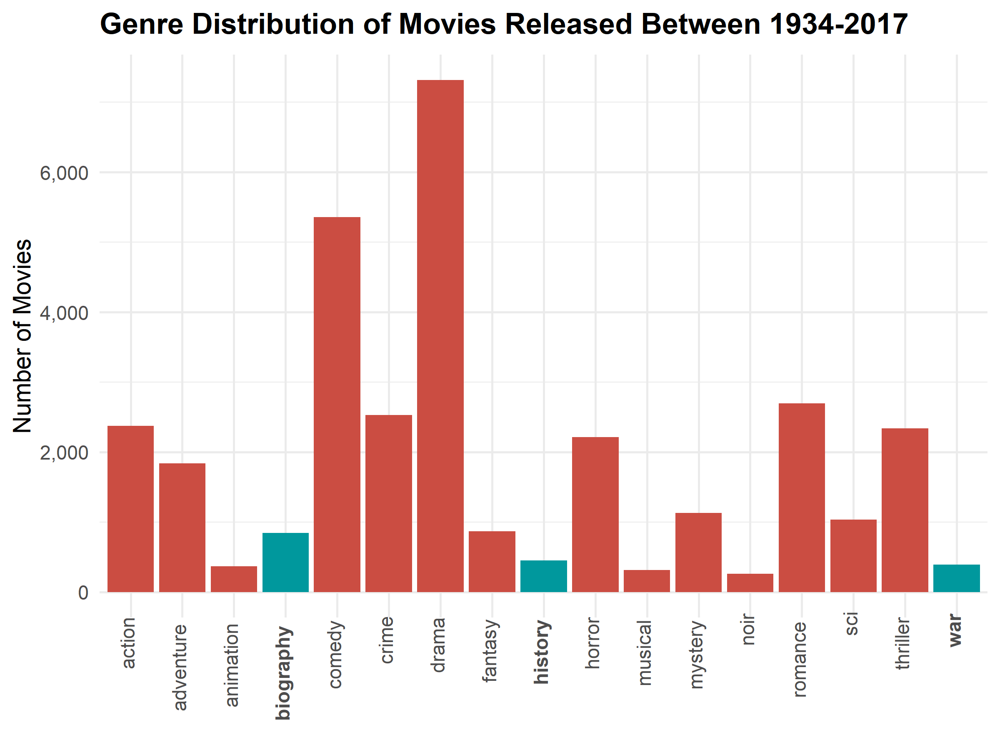
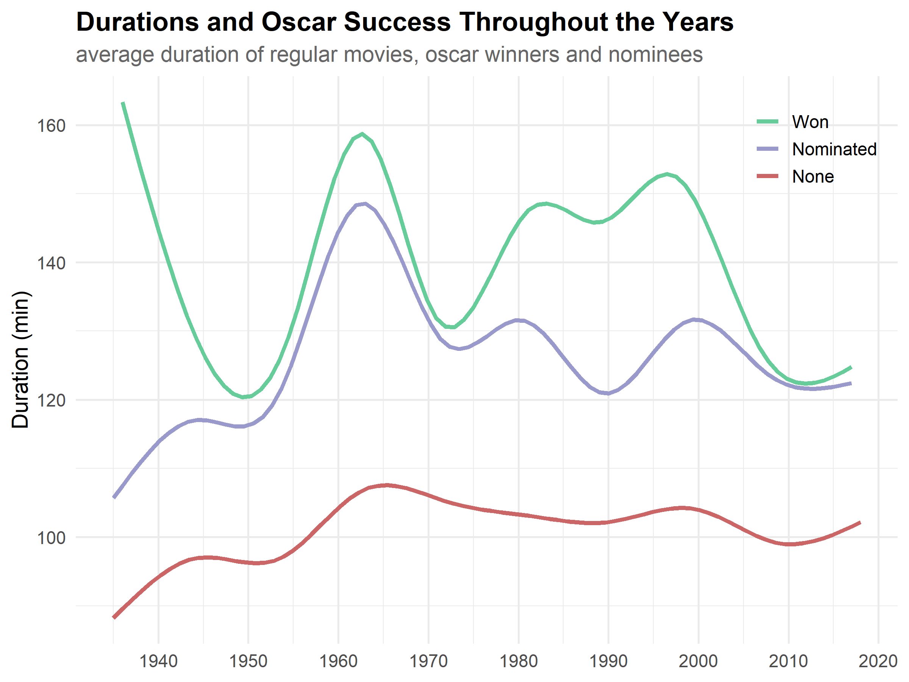

Is there such a thing as 'Oscar-bait?
================
Göksu Yıldırım

***Oscar** bait is a term used in the film community for movies that appear to have been produced for the sole purpose of earning nominations for Academy Awards or "Oscars", as they are commonly known.*

When a website I regularly read announced that they would accept reader articles for a limited time, I just had to write something. I had often entertained the idea of how cool it would be to have a [FiveThirtyEight](https://fivethirtyeight.com) style website about all things geeky and artsy; and also recently found out that IMDb offered datasets containing information about every movie on the site. It so happened to be that one of the ten topics the website asked articles for, was "Awards for Movies, Series, Games etc.". I decided to analyze IMDb data to see how data would support the public perception about the "template" for an Oscar-winning movie. After all, the datasets were there right? How hard could it be... Well it took me a loooooong time due to the nature of those datasets and some mistakes I made. Below, please find my final product.

IMDb provides the datasets in .tsv format. One major mistakes was that I sadly discovered way too late that I was missing a necessary parameter for *read\_tsv* function that lead me it to skip quite a few lines where importing. Like, about 2 million lines in a dataset of ~6 million. I was able to spot the mistake thanks to [Max Woolf's analysis of IMDb data](https://minimaxir.com/2018/07/imdb-data-analysis/). Full credit to him for *read\_imdb* function.

Now, before finally getting to the code a brief look at what information the datasets contain:

**title.akas:** We will get the title of the movies here. Other sets only use a unique alphanumeric identifier to differentiate movies. When joining, we need the this dataset to have the actual titles in our final data frame.

**title.basics:** This dataset has a lot of useful information. Mainly:

-   Format of the title, e.g. movie, tv series, short movie and so on.
-   Release year
-   Runtime in minutes
-   Genre. Each movie has up to three genres in this column.

**title.ratings:** The IMDb rating and the number of votes cast for a title is in this dataset.

**name.basics:** This dataset contain information about people. Names, birth and death years, primary profession (actress, director, writer etc.) and so on.

**title.principals:** This is a 28-million-plus line dataset that contains information about the crew & cast of every almost every title.

**academy\_awards:** This is a dataset that contains nominee and winner information for Oscars from it's beginning to 2015.

**oscars\_2015:** I manually created this small dataset which includes nominee and winner information for Oscars after from 2015 to today.

Now let's import the necessary packages and the datasets above.

``` r
library("tidyverse")
library("ggplot2")
library("ggrepel")
library("scales")
library("devtools")
library("cldr")
library("tidytext")
library("ggridges")
library("rvest")
library("RColorBrewer")
library("gghighlight")
```

``` r
read_imdb <- function(data_path) {
  path <- "C:/Users/Goksu/Desktop/Data Sciency/imdb/"
  read_tsv(paste0(path, data_path), na = "\\N", quote='', progress=F)
}

title_ratings <- read_imdb("title.ratings.tsv")
title_basics <- read_imdb("title.basics.tsv")
title_akas <- read_imdb("title.akas.tsv")
name_basics <- read_imdb("name.basics.tsv")
title_principles <- read_imdb("title.principals.tsv")
academy_awards <- read.csv("academy_awards.csv", stringsAsFactors = FALSE)
oscars_2015 <- read.csv("oscars_2015.csv", stringsAsFactors = FALSE)
```

Join title.ratings and title.basics to take a look at basic info about movies.

``` r
ratings_title <- inner_join(title_ratings, title_basics)
```

Now, it's pretty obvious we need to filter this. keeping in mind that our analysis will be about Oscars, my criteria are:

-   Format should be *movie*.
-   The movie should have had a certain amount of exposure, I will use movie with *1000+ votes for their name*.
-   Released after 1934. Until then, Oscars took place biannually. I would like to keep the period to one year for all movies analysed.
-   Finally, and hardest to filter, the movies should be in *English*.

First three are fairly easy to filter on.

``` r
ratings_title_filtered <- ratings_title %>% filter(numVotes > 1000 & titleType == "movie" & startYear > 1934)
```

Now, the last one is the hardest. None of the datasets has a country or language information. my initial idea is to use the **cldr** package for language identification: put the title of the movie in, get the language out. However, there is a slight problem. Movie titles are too short to properly identify the language of, so the accuracy is terrible if you choose this route. OMDb (Open Movie Database) API does not provide the country or language information either. After a lot of thought about how to tackle this problem, there seems to be only one good solution (which I've been trying to avoid): scraping the information myself.

I see that **Details** section on an IMDb page has the **Country** information I wanted (*it also has 'Language' as well, something I missed until it was too late*). Below code block scrapes the necesarry pages using **rvest** package, cleans the data and creates a dataframe with each movie's unique identifier and country of origin. There quite probably is a more compact way to do this but this is my first experience with web scraping, and honestly, I did better than I expected.

``` r
tconst_vector <- ratings_title_filtered %>% select(tconst) %>% unlist %>% unname %>% as.vector

url <- "https://www.imdb.com/title/"

country_data_full <- NULL

for (tconst in tconst_vector) {
  url_new <- paste(url,tconst, sep="")
  webpage <- read_html(url_new)
  country_data_html_full <- html_nodes(webpage,".txt-block:nth-child(4) , #titleDetails h2+ .txt-block , #titleDetails h2")
  country_data_full <- rbind(country_data_full, html_text(country_data_html_full))
}

country_data_full_df <- data.frame(Col2 = country_data_full[,2], Col3 = country_data_full[,3])
country_data_full_df$Combi <- paste(country_data_full_df$Col2, country_data_full_df$Col3)

countries_full <- str_extract(country_data_full_df$Combi, ".*Country:\n.*([[:alpha:]]).*") %>% strsplit("Country:\n")
countries_full <- countries_full %>% unlist
countries_full_df <- data.frame(Countries = countries_full)
countries_full_df <- countries_full_df %>% filter(str_detect(Countries, regex("\\w")))

countries_loop <- NULL

for (number in c(1:23223)) {
  countries_loop <- rbind(countries_loop, countries_full[[number]][2])
}

countries_loop %>% length
countries_loop_df <- data.frame(Country = countries_loop)
countries_loop_df$Country <- as.character(countries_loop_df$Country)

countries_loop_df <- cbind(tconst_vector, countries_loop_df)
countries_loop_df <- countries_loop_df %>% rename(tconst = tconst_vector)
```

Now finally we can add a country column to our data frame and filter movies from UK and USA.

``` r
ratings_title_filtered <- cbind(full_tconst_new_country) %>% filter(Country %in% c("USA", "UK"))
```

While we're filtering, lets filter our 'supporting' datasets as well. Filtering the 28.5M-row title\_principles to only include the movies from out updated ratings\_title\_filtered data frame will be helpful.

``` r
name_basics <- name_basics %>% filter(str_detect(primaryProfession, "actor|actress|director|writer")) %>% select(nconst, primaryName, birthYear, deathYear)
title_principles <- inner_join(title_principles, ratings_title_filtered) %>% select(tconst, originalTitle, ordering, nconst, category, characters) %>% filter(category %in% c("actor", "actress", "director", "producer", "writer")) %>% unique
```

Are we done with preprocessing? Nope. The dataset for Academy Awards uses award titles from the year of the award, meaning the same award goes by different titles throughout the dataset. We need award names to be consistent over the years. So let's do that and then add the awards for the last two missing years.

``` r
#WRITING
adapted_screenplay_syn <- c("Writing (Screenplay Based on Material Previously Produced or Published)", "Writing (Screenplay, Based on Material from Another Medium)", "Writing (Screenplay Based on Material from Another Medium)", "Writing (Adaptation)", "Writing (Screenplay, Adapted)", "Writing (Screenplay)") 

original_screenplay_syn <- c("Writing (Original Story)", "Writing (Screenplay, Original)", "Writing (Story and Screenplay, Based on Factual Material or Material Not Previously Published or Produced)", "Writing (Story and Screenplay, Based on Material Not Previously Published or Produced)", "Writing (Story and Screenplay, Written Directly for the Screen)", "Writing (Story and Screenplay)")

academy_awards <- academy_awards %>%
  mutate(Award = replace(Award, which(Award %in% original_screenplay_syn), "Writing (Original Screenplay)")) %>%  
  mutate(Award = replace(Award, which(Award %in% adapted_screenplay_syn), "Writing (Adapted Screenplay)"))

#BEST PICTURE  
best_picture_syn <- c("Best Picture", "Best Motion Picture", "Outstanding Motion Picture", "Outstanding Production")
academy_awards <- academy_awards %>% mutate(Award = replace(Award, which(Award %in% best_picture_syn), "Best Picture"))

#ACTOR & ACTRESS
academy_awards <- academy_awards %>% mutate(Award = replace(Award, which(Award == "Actor"), "Actor in a Leading Role"))
academy_awards <- academy_awards %>% mutate(Award = replace(Award, which(Award == "Actress"), "Actress in a Leading Role"))

#FILTER YEARS
years <- c(1934:2015) %>% as.character
academy_awards <- academy_awards %>% filter(Year %in% years)

#FILTER AWARDS
awards <- c("Writing (Original Screenplay)", "Writing (Adapted Screenplay)", "Best Picture", "Actor in a Leading Role", "Actress in a Leading Role","Actress in a Supporting Role","Actor in a Supporting Role", "Directing")
academy_awards <- academy_awards %>%  filter(Award %in% awards)

academy_awards$Award <- academy_awards$Award %>% as.factor
  
academy_awards <- academy_awards %>% select(Year, Award, Winner, Name, Film) %>% rbind(oscars_2015)
```

Before proceeding to some visualization I want to add a column to ratings\_title\_filtered to indicate whether a movie won an Oscar, was nominated for one, or nothing at all.

``` r
oscar_winners <- academy_awards %>% filter(Winner == 1 & Award == "Best Picture") %>% select(Name) %>% unlist %>% unname %>% as.vector %>% str_trim
oscar_nominees <- academy_awards %>% filter(is.na(Winner) & Award == "Best Picture") %>% select(Name) %>% unlist %>% unname %>% as.vector %>% str_trim

ratings_title_filtered$oscarStatus <- "None"

ratings_title_filtered <- ratings_title_filtered %>%
  mutate(oscarStatus = replace(oscarStatus, which(originalTitle %in% oscar_winners), "Won")) %>% 
  mutate(oscarStatus = replace(oscarStatus, which(originalTitle %in% oscar_nominees), "Nominated"))
```

We can finally create some pretty charts to see if such a thing as "oscar bait" really exists. First, let's take a look at genre-award relations.

``` r
prop.table(table(ratings_title_filtered$genre, ratings_title_filtered$oscarStatus),1)
```



Well, some genres definitely seem to have a better chance at the Oscars. Let's create a stacked bar chart to get a clearer view.

``` r
plot_1 <- exclude_these <- c(NA, "sport", "news", "film", "fi", "documentary", "adult", "music","family","western")

plot_1 <- ggplot(data=genre_prop %>% filter(!Var2=="None") %>% filter(!Var1 %in% exclude_these), aes(x=Var1,y=Freq, fill=Var2)) +
  geom_col() +
  theme_minimal(base_size = 16) +
  theme(axis.text.x = element_text(angle = 90, hjust=1.2, vjust=0.25), axis.title.x = element_blank(), legend.position = c(0.8,0.9), plot.subtitle = element_text(color="#666666"), plot.title = element_text(face="bold")) +
  scale_y_continuous(labels=scales::percent) +
  labs(y = "Ratio from all movies within same genre", title="Oscar Performances Per Genre", subtitle="percentage of movies from each genre winner/nominee for the Best Picture") +
  scale_fill_hue(name=NULL, labels=c("Nominated", "Won"), l=50)

ggsave("chart_1.png", plot_1, width=8, height=6)
```

 History, war and biography genres performances are noteworthy. More than 10% of history movies either won or nominated for the Best Picture award. That figure actually made me look back at my data to see if I made a mistake because I thought it was too high, but no, it is real. There is nothing more common than period movies among the list of Oscar winners/nominees, some examples being: 12 Years a Slave, Schindler's List, King's Speech, The Imitation Game, Dunkirk...

I wonder if people also like these same genres, or it's an academy-exclusive bias. Let's create a ridge density plot of IMDb scores for each genre.

``` r
plot_2 <- ggplot(data=ratings_title_filtered %>% filter(!genre %in% exclude_these), aes(x=averageRating, y=genre, fill=genre)) +
  geom_density_ridges(scale=1.75, rel_min_height = 0.1, alpha=0.6) +
  theme_minimal(base_size = 14) + 
  theme(axis.title.y = element_blank(), plot.subtitle = element_text(color="#666666", margin=margin(0,0,20,0)), plot.title = element_text(face="bold"), axis.text.y=element_text(face=c("plain", "plain","plain","bold","plain","plain","plain","plain","bold","plain","plain","plain","plain","plain","plain","plain","bold","plain"))) +
  scale_fill_hue(l=30, guide=FALSE) +
  labs(x = "IMDb Score", title="IMDb Score Per Genre", subtitle="how are IMDb scores distributed for each genre?")

ggsave("chart_2.png", plot_2, width=8, height=6)
```

 Well, good thing we did not outright blame the academy since we voted these very same genres as well. The ridges make their peak at higher scores than other genres for history, war and biography. But what if there are only a handful of *his-war-bio*, and most of them are actually oscar baits? That would mean most *his-war-bio* movies automatically has to be above a certain standard and that could explain higher mean scores. To make a decision, I want to look at the number of movies that came out from each genre between 1934-2017.

``` r
noMovies <- ratings_title_filtered %>% 
  group_by(genre) %>% 
  filter(!genre %in% exclude_these) %>%  
  summarise(noMovies = n()) %>% 
  mutate(colored = ifelse(genre %in% c("war", "history", "biography"), "1", "0"))

plot_3 <- ggplot(data=noMovies, aes(x=genre, y=noMovies, fill=colored)) +
   geom_col(alpha=1) +
  theme_minimal(base_size = 14) +
  theme(axis.text.x = element_text(angle = 90, hjust=1.2, vjust=0.25, face=c("plain", "plain","plain","bold","plain","plain","plain","plain","bold","plain","plain","plain","plain","plain","plain","plain","bold","plain")), axis.title.x = element_blank(), legend.position = c(0.9,0.9), plot.subtitle = element_text(color="#666666"), plot.title = element_text(face="bold", margin=margin(0,0,10,0))) +
  labs(y = "Number of Movies", title="Genre Distribution of Movies Released Between 1934-2017") +
  scale_fill_hue(name=NULL, l=50, guide=FALSE) +
  scale_y_continuous(label=comma)

ggsave("chart_3.png", plot_3, width=8, height=6)
```

 We got it. *His-war-bio* are among the least productive genres, however they consistently put out nominees and winners. That seems like Oscar baiting (and catching) to me.

One final metric I want to look into is **duration**. While I don't think there anybody would fight the claim that academy prefers longer movies, if there is, below will convince them otherwise.

``` r
plot_4 <- ggplot(data=ratings_title_filtered %>% filter(!genre %in% exclude_these), aes(x=startYear, y=runtimeMinutes, color=oscarStatus)) +
  geom_smooth(size=1.25, se=F) +
  theme_minimal(base_size = 14) +
  theme(axis.title.x = element_blank(), legend.position = c(0.9,0.9), plot.subtitle = element_text(color="#666666"), plot.title = element_text(face="bold"))+
  labs(y = "Duration (min)", title="Durations and Oscar Success Throughout the Years", subtitle="average duration of regular movies, oscar winners and nominees") +
  scale_x_continuous(breaks=pretty_breaks(12)) +
  scale_color_manual(values = c("#9999CC", "#CC6666", "#66CC99"), breaks = c("Won", "Nominated", "None"), labels=c("Won", "Nominated", "None"), guide_legend(title=""))

ggsave("chart_4.png", plot_4, width=8, height=6)
```

 Academy clearly wants to see longer movies.

#### Closing

There is still a lot we can look into to discover any biases while choosing the Best Picture: previous awards of the director and lead actor/actress, Rotten Tomatoes consensus, performance on other awards such as Golden Globes, producer/distributor company; age, gender and race of director and lead actor/actress and so on. Besides the whole bias discussion, we can also discover interesting relations, create predictive models and much more. After spending a lot of time cleaning and preparing this dataset for work, I definetely plan to do more with it.

#### What did I learn?

This exercise was very beneficial.

-   This was the first time I used pipes (%&gt;%) extensively. And I think there is no going back now. I wish I'd done that sooner.
-   Also my first time web scraping. I feel like learning this opened a huge door for me to access/collect my own data if something catches my attention. Also learned that Regular Expressions are my arch nemesis.
-   First time handling datasets with millions of rows. It was exciting to realize that Excel could not even fully open the dataset I was working on and that I have to be wary of my memory usage.
-   Although it didn't make it into the final work, using cldr package to language detection was cool, I can see myself using it on a future project. Maybe for something like a Twitter sentiment analysis.
-   I mostly use *for* when I need to loop because of my old C\# habit. I should become comfortable using *apply* family of methods.
