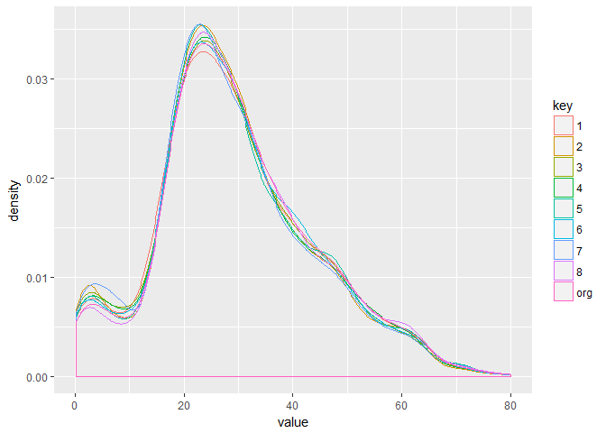
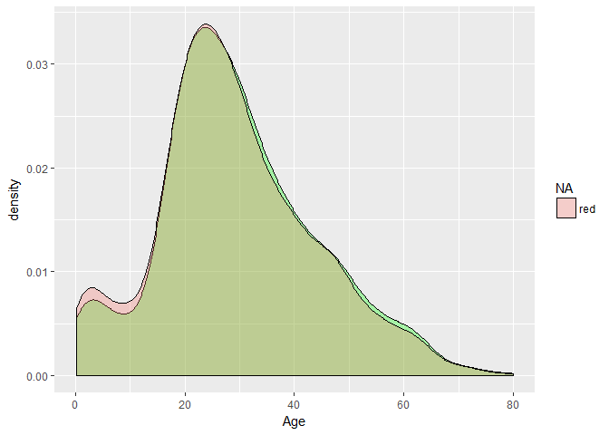

Titanic Survivor Prediction
================
Göksu Yıldırım

------------------------------------------------------------------------

### **Setting Up**

Loading required libraries

``` r
library(mice)
library(ggplot2)
library(tidyr)
library(dplyr)
library(rpart)
library(randomForest)
```

Loading datasets and combining them for easier missing value handling & feature engineering and factorizing some features.

``` r
train <- read.csv("train.csv", header = TRUE, stringsAsFactors = FALSE)
test <- read.csv("test.csv", header = TRUE, stringsAsFactors = FALSE)
test$Survived <- NA
test <- test[, c(1,12,2,3,4,5,6,7,8,9,10,11)]
all <- rbind(train,test)
all$Sex <- as.factor(all$Sex)
all$Embarked <- as.factor(all$Embarked)
```

### **Missing Values**

``` r
summary(all)
```

    ##   PassengerId      Survived          Pclass          Name          
    ##  Min.   :   1   Min.   :0.0000   Min.   :1.000   Length:1309       
    ##  1st Qu.: 328   1st Qu.:0.0000   1st Qu.:2.000   Class :character  
    ##  Median : 655   Median :0.0000   Median :3.000   Mode  :character  
    ##  Mean   : 655   Mean   :0.3838   Mean   :2.295                     
    ##  3rd Qu.: 982   3rd Qu.:1.0000   3rd Qu.:3.000                     
    ##  Max.   :1309   Max.   :1.0000   Max.   :3.000                     
    ##                 NA's   :418                                        
    ##      Sex           Age            SibSp            Parch      
    ##  female:466   Min.   : 0.17   Min.   :0.0000   Min.   :0.000  
    ##  male  :843   1st Qu.:21.00   1st Qu.:0.0000   1st Qu.:0.000  
    ##               Median :28.00   Median :0.0000   Median :0.000  
    ##               Mean   :29.88   Mean   :0.4989   Mean   :0.385  
    ##               3rd Qu.:39.00   3rd Qu.:1.0000   3rd Qu.:0.000  
    ##               Max.   :80.00   Max.   :8.0000   Max.   :9.000  
    ##               NA's   :263                                     
    ##     Ticket               Fare            Cabin           Embarked
    ##  Length:1309        Min.   :  0.000   Length:1309         :  2   
    ##  Class :character   1st Qu.:  7.896   Class :character   C:270   
    ##  Mode  :character   Median : 14.454   Mode  :character   Q:123   
    ##                     Mean   : 33.295                      S:914   
    ##                     3rd Qu.: 31.275                              
    ##                     Max.   :512.329                              
    ##                     NA's   :1

*Age* has 263 missing values, *Fare* has a single one. Also there are two blank values in *Embarked* and 1014 blank values in *Cabin*.

#### Embarked

Southampton is the port where the clear majority has embarked from. So assigning the missing two cases to Southampton is plausible.

``` r
all[all$Embarked == "",]$Embarked <- "S"
```

#### Fare

There is only a single case where the Fare is missing. I will replace it with the median Fare value.

``` r
all$Fare[is.na(all$Fare)] <- median(all$Fare, na.rm = TRUE)
```

#### Age

``` r
prop.table((table(is.na(all$Age), all$Sex)), 2)
```

    ##        
    ##            female      male
    ##   FALSE 0.8326180 0.7805457
    ##   TRUE  0.1673820 0.2194543

``` r
prop.table((table(is.na(all$Age), all$Pclass)), 2)
```

    ##        
    ##                  1          2          3
    ##   FALSE 0.87925697 0.94223827 0.70662906
    ##   TRUE  0.12074303 0.05776173 0.29337094

``` r
prop.table((table(is.na(all$Age), all$Embarked)), 2)
```

    ##        
    ##                  C         Q         S
    ##   FALSE  0.7851852 0.4065041 0.8558952
    ##   TRUE   0.2148148 0.5934959 0.1441048

There is discrepancy between the ratio of missing ages for females vs males (16.7% vs 21.9%). However more noteworthy are the discrepancies between different classes and embarked ports. Pclass 3 has a missing Age ratio of 29.3% whereas it is 5.8% for Pclass 2. Likewise, Embarked Q has a missing Age ratio of 59.3%, much higher than other ports. Also, 91.9% of passengers who embarked from Port Q were Class 3. Missing-at-Random decided, we can use predictive mean matching to complete the Age data.

``` r
tempAge <- mice(all, m=8, meth="pmm", seed=500)
```

    ## 
    ##  iter imp variable
    ##   1   1  Survived  Age
    ##   1   2  Survived  Age
    ##   1   3  Survived  Age
    ##   1   4  Survived  Age
    ##   1   5  Survived  Age
    ##   1   6  Survived  Age
    ##   1   7  Survived  Age
    ##   1   8  Survived  Age
    ##   2   1  Survived  Age
    ##   2   2  Survived  Age
    ##   2   3  Survived  Age
    ##   2   4  Survived  Age
    ##   2   5  Survived  Age
    ##   2   6  Survived  Age
    ##   2   7  Survived  Age
    ##   2   8  Survived  Age
    ##   3   1  Survived  Age
    ##   3   2  Survived  Age
    ##   3   3  Survived  Age
    ##   3   4  Survived  Age
    ##   3   5  Survived  Age
    ##   3   6  Survived  Age
    ##   3   7  Survived  Age
    ##   3   8  Survived  Age
    ##   4   1  Survived  Age
    ##   4   2  Survived  Age
    ##   4   3  Survived  Age
    ##   4   4  Survived  Age
    ##   4   5  Survived  Age
    ##   4   6  Survived  Age
    ##   4   7  Survived  Age
    ##   4   8  Survived  Age
    ##   5   1  Survived  Age
    ##   5   2  Survived  Age
    ##   5   3  Survived  Age
    ##   5   4  Survived  Age
    ##   5   5  Survived  Age
    ##   5   6  Survived  Age
    ##   5   7  Survived  Age
    ##   5   8  Survived  Age

Plotting all imputation together to identify which one represents original data the best

``` r
age_df <- data.frame(org <- all$Age)

while (ncol(age_df) < 9) {
  age_df <- cbind(age_df, data.frame(mice::complete(tempAge, (ncol(age_df)))$Age))
}

colnames(age_df) <- c("org", 1:8)

ggplot(gather(age_df), aes(x=value, color=key)) + geom_density(aes(group=key))
```

    ## Warning: Removed 263 rows containing non-finite values (stat_density).



``` r
ggplot(all, aes(x=Age)) + geom_density(fill="green", alpha = 0.3) + geom_density(data=mice::complete(tempAge,3), aes(fill="red"), alpha=0.3)
```

    ## Warning: Removed 263 rows containing non-finite values (stat_density).

 Upon inspection imputed dataset 3 is selected for further analysis.

``` r
all$Age <- mice::complete(tempAge,3)$Age
```

And finally

``` r
all[all$Cabin == "","Cabin"] <- NA
```

### \*Feature Engineering\*\*

#### FamilySize

First, let's combine *SibSp* and *Parch* under the new feature **FamilySize**

``` r
all$FamilySize <- all$SibSp + all$Parch + 1
```

#### Family

Second, I will try to identify families travelling together.

``` r
all$FamilyName <- as.factor(sapply(all$Name, function(x){strsplit(x, ', ')}[[1]][1]))
length(unique(all$FamilyName))
```

    ## [1] 875

There are 875 unqiue FamilyNames. There seems to be 14 families with more than 5 members. When we look into some of these families we can see they are usually made up of either a big family or a big family mixed up with several single travellers with the same family name We can also see that, with a few exceptions, families travel under the same ticker number. So we can use FamilyName+TicketNo as a unique identifier for families.

``` r
all$Family <- paste(all$FamilyName, all$Ticket, sep="-")
```

#### Titles

Every name on the list contain some kind of a title. This indicator of social status quite probably related to the survival of a person. So let's extract these titles from names and group rare titles with closest popular title.

``` r
all$Titles <- sapply(strsplit(all$Name, "[,|.]"), "[[", 2)
all$Titles[all$Titles %in% c(' Mlle', ' Ms')] <- ' Miss'
all$Titles[all$Titles %in% c(' Mme')] <- ' Mrs'
all$Titles[all$Titles %in% c(" Capt", " Don", " Major", " Sir", " Col")] <- " Sir"
all$Titles[all$Titles %in% c(' Dona', ' Lady', ' the Countess', ' Jonkheer')] <- ' Lady'
all$Titles[all$Titles %in% c(' Dr', ' Rev')] <- ' DrRev'
all$Titles <- as.factor(all$Titles)
```

#### Deck

Looking at individual cabins might be too specific but the *Cabin* feature holds another info: the deck that cabin is in. Decks might be important for survival with their proximity to disaster boats or priority in evacuation etc. However there is a problem: missing values make up %77 of cases for the *Cabin* feature! Can I do something about this?

First, extract the deck info from known cabins:

``` r
all$Deck <- as.factor(sapply(all$Cabin, function(x){substr(x, 1,1)}[1]))
```

A safe assumption would be that families travelling together stay at the same deck even if using multiple cabins.

``` r
familiesWithCabin <- spread(as.data.frame(prop.table(table(all$Family,is.na(all$Cabin)), 1)), Var2, Freq)
colnames(familiesWithCabin) <- c("family","knownCabin","noKnownCabin")
summary(familiesWithCabin[familiesWithCabin$knownCabin > "0", ])
```

    ##              family      knownCabin      noKnownCabin    
    ##  Abelseth-348122:  1   Min.   :0.3333   Min.   :0.00000  
    ##  Allen-24160    :  1   1st Qu.:1.0000   1st Qu.:0.00000  
    ##  Allison-113781 :  1   Median :1.0000   Median :0.00000  
    ##  Anderson-19952 :  1   Mean   :0.9938   Mean   :0.00623  
    ##  Andrews-112050 :  1   3rd Qu.:1.0000   3rd Qu.:0.00000  
    ##  Andrews-13502  :  1   Max.   :1.0000   Max.   :0.66667  
    ##  (Other)        :208

There are 214 families with known cabins for at least one member. Let's extract which deck their room is on, assign all family members to the same deck.

``` r
familyDecks <- unique(all[!is.na(all$Deck) & all$SibSp + all$Parch > 0, c("Family", "Deck")])

familyDecks$Deck <- as.character(familyDecks$Deck)

deckAssigner <- function(Family, Deck) {
  ifelse (Family %in% familyDecks$Family, familyDecks$Deck, Deck)
}


all[is.na(all$Deck),]$Deck = apply(all[ is.na(all$Deck),c("Family", "Deck")], 1, function(y) deckAssigner(y["Family"], y["Deck"]))
```

Well, unfortunately this procedure helped us with just 4 missing values. Are there other features that might help me?

``` r
prop.table(table(is.na(all$Deck), all$Pclass), 1)
```

    ##        
    ##                  1          2          3
    ##   FALSE 0.86287625 0.07692308 0.06020067
    ##   TRUE  0.06435644 0.25148515 0.68415842

Most of the missing cabin info is related with Pclass 3 (68.4%). Pclass 1 has very few missing cabins with only 6.4%.

``` r
prop.table(table(all$Deck, all$Pclass), 1)
```

    ##    
    ##              1          2          3
    ##   A 1.00000000 0.00000000 0.00000000
    ##   B 1.00000000 0.00000000 0.00000000
    ##   C 0.97959184 0.00000000 0.02040816
    ##   D 0.86956522 0.13043478 0.00000000
    ##   E 0.82926829 0.09756098 0.07317073
    ##   F 0.00000000 0.61904762 0.38095238
    ##   G 0.00000000 0.00000000 1.00000000
    ##   T 1.00000000 0.00000000 0.00000000

The distribution of classes to decks doesn't look random. We can see that each deck has a signifcant preference for a Pclass. I can assign decks to passengers according the the Pclass distributions. For this, I manually calculated how many people should be assigned to each deck from each class to keep the ratios unchanged.

``` r
all[which(is.na(all$Deck) & all$Pclass==1), ][(sample(nrow(all[which(is.na(all$Deck) & all$Pclass==1),]), size=5)), "Deck"] <- "A"
all[which(is.na(all$Deck) & all$Pclass==1), ][(sample(nrow(all[which(is.na(all$Deck) & all$Pclass==1),]), size=16)), "Deck"] <- "B"
all[which(is.na(all$Deck) & all$Pclass==1), ][(sample(nrow(all[which(is.na(all$Deck) & all$Pclass==1),]), size=25)), "Deck"] <- "C"
all[which(is.na(all$Deck) & all$Pclass==1), ][(sample(nrow(all[which(is.na(all$Deck) & all$Pclass==1),]), size=9)), "Deck"] <- "D"
all[which(is.na(all$Deck) & all$Pclass==1), ][(sample(nrow(all[which(is.na(all$Deck) & all$Pclass==1),]), size=8)),"Deck"] <- "E"
all[which(is.na(all$Deck) & all$Pclass==1), ][(sample(nrow(all[which(is.na(all$Deck) & all$Pclass==1),]), size=2)),"Deck"] <- "T"

all[which(is.na(all$Deck) & all$Pclass==2), ][(sample(nrow(all[which(is.na(all$Deck) & all$Pclass==2),]), size=66)),"Deck"] <- "D"
all[which(is.na(all$Deck) & all$Pclass==2), ][(sample(nrow(all[which(is.na(all$Deck) & all$Pclass==2),]), size=44)),"Deck"] <- "E"
all[which(is.na(all$Deck) & all$Pclass==2), ][(sample(nrow(all[which(is.na(all$Deck) & all$Pclass==2),]), size=144)),"Deck"] <- "F"

all[which(is.na(all$Deck) & all$Pclass==3), ][(sample(nrow(all[which(is.na(all$Deck) & all$Pclass==3),]), size=77)),"Deck"] <- "C"
all[which(is.na(all$Deck) & all$Pclass==3), ][(sample(nrow(all[which(is.na(all$Deck) & all$Pclass==3),]), size=115)),"Deck"] <- "E"
all[which(is.na(all$Deck) & all$Pclass==3), ][(sample(nrow(all[which(is.na(all$Deck) & all$Pclass==3),]), size=307)),"Deck"] <- "F"
all[which(is.na(all$Deck) & all$Pclass==3), ][(sample(nrow(all[which(is.na(all$Deck) & all$Pclass==3),]), size=192)),"Deck"] <- "G"

all$Deck <- as.factor(all$Deck)
```

Finally, seperating test & train data sets

``` r
train <- all[1:891,]
test <- all[892:1309,]
```

### **Prediction**

#### Logistic Regression

``` r
surv_fit_logres <- glm(as.factor(Survived)~ Pclass + Sex + Age + Embarked + Titles + FamilySize + Fare + Deck, family = binomial, data=train)

summary(surv_fit_logres)
```

    ## 
    ## Call:
    ## glm(formula = as.factor(Survived) ~ Pclass + Sex + Age + Embarked + 
    ##     Titles + FamilySize + Fare + Deck, family = binomial, data = train)
    ## 
    ## Deviance Residuals: 
    ##     Min       1Q   Median       3Q      Max  
    ## -2.2382  -0.5802  -0.3393   0.5263   2.5473  
    ## 
    ## Coefficients:
    ##                 Estimate Std. Error z value Pr(>|z|)    
    ## (Intercept)    3.193e+01  1.193e+03   0.027 0.978651    
    ## Pclass        -1.106e+00  1.916e-01  -5.773 7.77e-09 ***
    ## Sexmale       -2.949e+01  1.193e+03  -0.025 0.980282    
    ## Age           -3.148e-02  8.440e-03  -3.730 0.000191 ***
    ## EmbarkedQ     -1.335e-01  3.939e-01  -0.339 0.734798    
    ## EmbarkedS     -4.340e-01  2.538e-01  -1.710 0.087256 .  
    ## Titles Lady   -1.385e+01  9.084e+02  -0.015 0.987836    
    ## Titles Master  3.510e+00  9.719e-01   3.611 0.000305 ***
    ## Titles Miss   -2.629e+01  1.193e+03  -0.022 0.982424    
    ## Titles Mr      1.738e-01  8.338e-01   0.208 0.834906    
    ## Titles Mrs    -2.546e+01  1.193e+03  -0.021 0.982976    
    ## Titles Sir     9.940e-01  1.166e+00   0.852 0.394115    
    ## FamilySize    -4.779e-01  8.695e-02  -5.496 3.88e-08 ***
    ## Fare           4.773e-03  2.933e-03   1.628 0.103628    
    ## DeckB         -2.288e-02  6.771e-01  -0.034 0.973047    
    ## DeckC         -5.351e-01  6.206e-01  -0.862 0.388523    
    ## DeckD          2.456e-01  6.545e-01   0.375 0.707511    
    ## DeckE          3.381e-01  6.322e-01   0.535 0.592744    
    ## DeckF         -1.146e-01  6.399e-01  -0.179 0.857861    
    ## DeckG         -2.100e-01  6.883e-01  -0.305 0.760301    
    ## DeckT         -1.952e+00  1.996e+00  -0.978 0.327989    
    ## ---
    ## Signif. codes:  0 '***' 0.001 '**' 0.01 '*' 0.05 '.' 0.1 ' ' 1
    ## 
    ## (Dispersion parameter for binomial family taken to be 1)
    ## 
    ##     Null deviance: 1186.7  on 890  degrees of freedom
    ## Residual deviance:  710.8  on 870  degrees of freedom
    ## AIC: 752.8
    ## 
    ## Number of Fisher Scoring iterations: 14

``` r
Prediction_logres <- predict(surv_fit_logres, type="response", newdata=test)
test$Survived <- as.numeric(Prediction_logres >= 0.5)
submission_file_logres <- data.frame(test[c("PassengerId","Survived")])
write.csv(submission_file_logres, file = "submission_logres.csv", row.names = FALSE)
```

**Score:** 0.770

#### CART

``` r
surv_fit_cart <- rpart(as.factor(Survived) ~ Pclass + Sex + Age + Embarked + Titles + FamilySize + Fare + Deck, data=train, method="class")

Prediction <- predict(surv_fit_cart, test, type="class")
submission_file <- data.frame(PassengerId = test$PassengerId, Survived = Prediction)
write.csv(submission_file, file = "submission_cart.csv", row.names = FALSE)
```

**Score:** 0.799

#### Random Forest

``` r
surv_fit <- randomForest(as.factor(Survived) ~ Pclass + Sex + Age + Embarked + Titles + FamilySize + Fare + Deck, data=train, importance=TRUE, ntree=2000)

Prediction <- predict(surv_fit, test)
submission_file <- data.frame(PassengerId = test$PassengerId, Survived = Prediction)
write.csv(submission_file, file = "submission.csv", row.names = FALSE)
```

**Score:** 0.794
